# :rocket: **Instructions for Flightstack Setup**

## Contents

1. [Setting up the Pixhawk 6c](#1-setting-up-the-pixhawk-6c)  
   1.1 [Compiling the firmware](#11-compiling-the-firmware)  
   1.2 [Parameters setting](#12-parameters-setting)  
   &nbsp;&nbsp;&nbsp;&nbsp;1.2.1 [GPS configuration](#121-gps-configuration)  
   &nbsp;&nbsp;&nbsp;&nbsp;1.2.2 [VICON configuration](#122-vicon-configuration)

2. [Flashing the OS to the Odroid M1S](#2-flashing-the-os-to-the-odroid-m1s)

3. [Setting up the ODroid M1S with Desktop GUI](#3-setting-up-the-odroid-m1s-with-desktop-gui)  
   3.1 [Initial setup](#31-initial-setup)  
   3.2 [Set time](#32-set-time)  
   3.3 [Configure Automatic Login for when Odroid is powered on](#33-configure-automatic-login-for-when-odroid-is-powered-on)  
   3.4 [Update the ODroid M1S](#34-update-the-odroid-m1s)  
   3.5 [Install git and nano](#35-install-git-and-nano)  
   3.6 [Install “libasio-dev” Package](#36-install-libasio-dev-package)  
   3.7 [Setting the RTC clock](#37-setting-the-rtc-clock)  
   3.8 [Check for USB communication](#38-check-for-usb-communication)  
   3.9 [Install latest CMake Package](#39-install-latest-cmake-package)  
   3.10 [Setting up the Access Point](#310-setting-up-the-access-point)  
   3.11 [Installing ROS2 Foxy](#311-installing-ros2-foxy)  
   3.12 [Install μXRCE-DDS](#312-install-μxrce-dds)  
   3.13 [Creating a system rule for the pixhawk](#313-creating-a-system-rule-for-the-pixhawk)  
   3.14 [Deleting unnecessary packages](#314-deleting-unnecessary-packages)

4. [Setting up the ODroid M1S as a server with ROS2 Humble](#4-setting-up-the-odroid-m1s-as-server-with-ros2-humble)  
    4.1 [Check the timezone](#41-check-the-timezone)  
    4.2 [Update the ODroid](#42-update-the-odroid)  
    4.3 [Install git and nano](#43-install-git-and-nano)  
    4.4 [Install "libasio-dev" Package](#44-install-libasio-dev-package)  
    4.5 [Install "lsusb" Package](#45-install-lsusb-package)  
    4.6 [Setting the RTC clock](#46-setting-the-rtc-clock)  
    4.7 [Check For USB communication](#47-check-for-usb-communication)  
    4.8 [Install latest CMake Package](#48-install-latest-cmake-package)  
    4.9 [Setting up the Access Point](#49-setting-up-the-access-point)  
    4.10 [Installing ROS2 Humble](#410-installing-ros2humble)  
    4.11 [Install μXRCE-DDS](#411-install-μxrce-dds)  
    4.12 [Install python3 packages](#412-install-python3-packages)  
    4.13 [Compile boost from source](#413-compile-boost-from-source)  

5. [Commands for debugging in MAVLink Shell-QGroundControl](#5-commands-for-debugging-in-mavlink-shell-qgroundcontrol)

6. [Installing ROS2 Galactic on Odroid](#6-installing-ros2-galactic-on-odroid)

7. [Setting up intel NUC with ROS2 Humble](#7-setting-up-intel-nuc-with-ros2-humble)  
    7.1 [Setting up Kernel](#71-setting-up-kernel)  
    7.2 [Install libasio](#72-install-libasio)  
    7.3 [Install latest CMake Package](#73-install-latest-cmake-package)  
    7.4 [Setting up the Access Point](#74-setting-up-the-access-point)  
    7.5 [Installing Latest Boost Libraries](#75-installing-latest-boost-libraries)  
    7.6 [Install ROS2 Humble Barebones](#76-install-ros2-humble-barbones)  
    7.7 [Install librealsense sdk v2.53.1](#77-install-librealsense-sdk-v2531)

8. [C++ wrapper for Python using Boost Libraries](#8-c-wrapper-for-python-using-boost-libraries)

9. [Create your own ROS2 package on Odroid](#9-create-your-own-ros2-package-on-odroid)  
   9.1 [Create the workspace](#91-create-the-workspace)  
   9.2 [Create the package](#92-create-the-package)  
   9.3 [Example: thrust_stand package for directly controlling motors](#93-example-thrust_stand-package-for-directly-controlling-motors)  
   &nbsp;&nbsp;&nbsp;&nbsp;9.3.1 [Directories structure](#931-directories-structure)  
   &nbsp;&nbsp;&nbsp;&nbsp;9.3.2 [control_motors.cpp](#932-control_motorscpp)  
   &nbsp;&nbsp;&nbsp;&nbsp;9.3.3 [package.xml](#933-packagexml)  
   &nbsp;&nbsp;&nbsp;&nbsp;9.3.4 [CMakeLists.txt](#934-cmakeliststxt)

10. [Flightstack](#10-flightstack)  
   10.1 [Running the Flightstack with Real-Time priority](#101-running-the-flightstack-with-real-time-priority)

11. [GPS Firmware Update](#11-gps-firmware-update)  
    11.1 [Flash Ardupilot Firmware onto Pixhawk](#111-flash-ardupilot-firmware-onto-pixhawk)  
    11.2 [Installing Ardupilot](#112-installing-ardupilot)  
    


# 1 Setting up the Pixhawk 6c
## 1.1 Compiling the firmware

First, install git on your ground pc

```bash
    sudo apt-get update
    sudo apt-get install git
```

Now check the version of git and make sure that is at least `2.20.0` by typing

```bash
    git --version
```

Now, we need to download a very specific version of the PX4-Autopilot firmware. It has to be `v1.15`, as we have validated our hardware with that specific PX4-Autopilot. In your terminal, run this command to clone the git repository,

```bash
    git clone https://github.com/PX4/PX4-Autopilot.git
```

Now, we have to setup the developer toolchain to make the submodules and flash the firmware to our Pixhawk 6c. To do this, it's quite simple, run the following command,

```bash
    sudo bash ./PX4-Autopilot/Tools/setup/ubuntu.sh
```

We then will be prompted to reboot the groundstation pc. After making sure all your other programs are closed and your work is saved, reboot:

```bash
    sudo reboot
```

After reboot, run the following in a terminal and check if they throw a `command not found` error. If they do not, we have the compiler setup to compile the firmware for the Pixhawk 6C.

```bash
    arm-none-eabi-gcc --version
    arm-none-eabi-g++ --version
    arm-none-eabi-gdb --version
    arm-none-eabi-size --version
```

After that, navigate to the `PX4-Autopilot` directory,

```bash
    cd <path-to>/PX4-Autopilot
    git checkout v1.15
    make submodulesclean
```

> **Note:** We are using PX4 version `v1.15`. Specific PX4 point releases are made as tags of the release branches, and are named using the format `v<release>`. These are listed on GitHub (or you can query all tags using `git tag -l`).  
> At the time of writing, `v1.15` is the latest release. Therefore, we will be using `git checkout main` instead of `git checkout v1.15`.  
> Always confirm the latest version on the PX4 dev website and adjust accordingly.

> **Note:** `git checkout v1.15` changes the Git HEAD to our specific version, and running `make submodulesclean` sets up all the dependencies for that version.

We now want to make changes to the topics that `μXRCE-DDS` on the Pixhawk publishes the right topics and lets us write to specific topics. To that extent, we need to modify the `dds_topics.yaml` located in `<path_to_folder>/PX4-Autopilot/src/modules/uxrce_dds_client/` folder. Here is the setup for our topics we want published and subscribed to.

*Please note that the topics that Pixhawk sends to the ODroid M1s are under `/out/` and the topics we send to the Pixhawk from the ODroid M1s are under `/in/`.*

Our example for the `dds_topics.yaml` file is given below:

```python
    #####
    #
    # This file maps all the topics that are to be used on the uXRCE-DDS client.
    #
    #####
    publications:
      - topic: /fmu/out/register_ext_component_reply
        type: px4_msgs::msg::RegisterExtComponentReply

      - topic: /fmu/out/arming_check_request
        type: px4_msgs::msg::ArmingCheckRequest

      - topic: /fmu/out/mode_completed
        type: px4_msgs::msg::ModeCompleted

      - topic: /fmu/out/battery_status
        type: px4_msgs::msg::BatteryStatus

      - topic: /fmu/out/collision_constraints
        type: px4_msgs::msg::CollisionConstraints

      - topic: /fmu/out/estimator_status_flags
        type: px4_msgs::msg::EstimatorStatusFlags

      - topic: /fmu/out/failsafe_flags
        type: px4_msgs::msg::FailsafeFlags

      - topic: /fmu/out/manual_control_setpoint
        type: px4_msgs::msg::ManualControlSetpoint

      - topic: /fmu/out/message_format_response
        type: px4_msgs::msg::MessageFormatResponse

      - topic: /fmu/out/position_setpoint_triplet
        type: px4_msgs::msg::PositionSetpointTriplet

      - topic: /fmu/out/sensor_combined
        type: px4_msgs::msg::SensorCombined

      - topic: /fmu/out/timesync_status
        type: px4_msgs::msg::TimesyncStatus

       # - topic: /fmu/out/vehicle_angular_velocity
       #   type: px4_msgs::msg::VehicleAngularVelocity

      - topic: /fmu/out/vehicle_attitude
        type: px4_msgs::msg::VehicleAttitude

      - topic: /fmu/out/vehicle_control_mode
        type: px4_msgs::msg::VehicleControlMode

      - topic: /fmu/out/vehicle_command_ack
        type: px4_msgs::msg::VehicleCommandAck

      - topic: /fmu/out/vehicle_global_position
        type: px4_msgs::msg::VehicleGlobalPosition

      - topic: /fmu/out/vehicle_gps_position
        type: px4_msgs::msg::SensorGps

      - topic: /fmu/out/vehicle_local_position
        type: px4_msgs::msg::VehicleLocalPosition

      - topic: /fmu/out/vehicle_odometry
        type: px4_msgs::msg::VehicleOdometry

      - topic: /fmu/out/vehicle_status
        type: px4_msgs::msg::VehicleStatus

      - topic: /fmu/out/vehicle_trajectory_waypoint_desired
        type: px4_msgs::msg::VehicleTrajectoryWaypoint

    # Create uORB::Publication
    subscriptions:
      - topic: /fmu/in/register_ext_component_request
        type: px4_msgs::msg::RegisterExtComponentRequest

      - topic: /fmu/in/unregister_ext_component
        type: px4_msgs::msg::UnregisterExtComponent

      - topic: /fmu/in/config_overrides_request
        type: px4_msgs::msg::ConfigOverrides

      - topic: /fmu/in/arming_check_reply
        type: px4_msgs::msg::ArmingCheckReply

      - topic: /fmu/in/message_format_request
        type: px4_msgs::msg::MessageFormatRequest

      - topic: /fmu/in/mode_completed
        type: px4_msgs::msg::ModeCompleted

      - topic: /fmu/in/config_control_setpoints
        type: px4_msgs::msg::VehicleControlMode

      - topic: /fmu/in/manual_control_input
        type: px4_msgs::msg::ManualControlSetpoint

      - topic: /fmu/in/offboard_control_mode
        type: px4_msgs::msg::OffboardControlMode

      - topic: /fmu/in/onboard_computer_status
        type: px4_msgs::msg::OnboardComputerStatus

      - topic: /fmu/in/obstacle_distance
        type: px4_msgs::msg::ObstacleDistance

      - topic: /fmu/in/sensor_optical_flow
        type: px4_msgs::msg::SensorOpticalFlow

      - topic: /fmu/in/goto_setpoint
        type: px4_msgs::msg::GotoSetpoint

      - topic: /fmu/in/telemetry_status
        type: px4_msgs::msg::TelemetryStatus

      - topic: /fmu/in/trajectory_setpoint
        type: px4_msgs::msg::TrajectorySetpoint

      - topic: /fmu/in/vehicle_attitude_setpoint
        type: px4_msgs::msg::VehicleAttitudeSetpoint

      - topic: /fmu/in/vehicle_mocap_odometry
        type: px4_msgs::msg::VehicleOdometry

      - topic: /fmu/in/vehicle_rates_setpoint
        type: px4_msgs::msg::VehicleRatesSetpoint

      - topic: /fmu/in/differential_drive_setpoint
        type: px4_msgs::msg::DifferentialDriveSetpoint

      - topic: /fmu/in/vehicle_visual_odometry
        type: px4_msgs::msg::VehicleOdometry

      - topic: /fmu/in/vehicle_command
        type: px4_msgs::msg::VehicleCommand

      - topic: /fmu/in/vehicle_command_mode_executor
        type: px4_msgs::msg::VehicleCommand

      - topic: /fmu/in/vehicle_trajectory_bezier
        type: px4_msgs::msg::VehicleTrajectoryBezier

      - topic: /fmu/in/vehicle_trajectory_waypoint
        type: px4_msgs::msg::VehicleTrajectoryWaypoint

      - topic: /fmu/in/vehicle_thrust_setpoint
        type: px4_msgs::msg::VehicleThrustSetpoint

      - topic: /fmu/in/vehicle_torque_setpoint
        type: px4_msgs::msg::VehicleTorqueSetpoint

      - topic: /fmu/in/actuator_motors
        type: px4_msgs::msg::ActuatorMotors

      - topic: /fmu/in/actuator_servos
        type: px4_msgs::msg::ActuatorServos

      - topic: /fmu/in/aux_global_position
        type: px4_msgs::msg::VehicleGlobalPosition

    # Create uORB::PublicationMulti
    subscriptions_multi:
```
Now, we can configure the firmware from the PX4-Autopilot root directory. We want to remove a very specific module from our configuration (**this is not necessary as of 06/01/2024 and you can proceed to the uninstall `Modemmanager` step, but you might want to do this if you get space constraint errors when you use the command**, `make px4_fmu-v6c`). This is done to save space on the *flash* memory of the Pixhawk 6C. The Pixhawk 6C's flash memory cannot hold the full extent of the `v1.15` autopilot firmware. Run,

```bash
    cd <path-to>/PX4-Autopilot/
    make px4_fmu-v6c boardconfig
```

> **Note:** For us, the path to where we saved is `~/Workspace/PX4/PX4-Autopilot`, for example. We use `v6c` as we are using the Pixhawk 6C, and that is the specified target platform. For older or newer versions of Pixhawk, please refer to the PX4 development guide.
 
 #### Figure 1
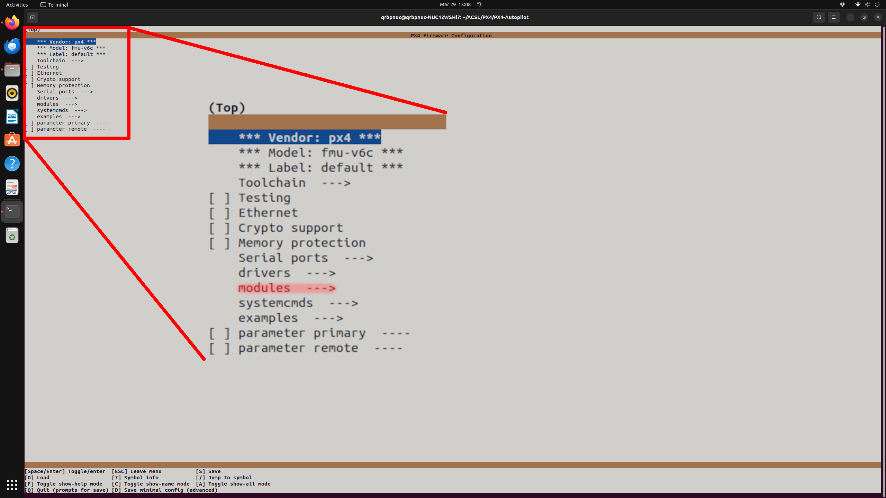

*[Figure 1](#figure-1): PX4-Autopilot firmware configurator screen 1*

Now, you will be greeted with a terminal screen as shown in [Figure 1](#figure-1). Navigate to the `modules --->` option using the arrow keys and select it using the `spacebar` key. You will then enter a new window as shown in [Figure 2](#figure-2). 
Please toggle off the `vtol_att_control` option using the `spacebar` key and then save the settings by pressing the `q` key. You will now exit the configurator with the right options set. We do not use the `vtol_att_control` module to control our drones as we write our own controllers. Therefore, this module can be removed without breaking the autopilot firmware as it is relatively disconnected from the rest of the stack. We **strongly** recommend that you follow this setup exactly while configuring the modules as enabling or disabling other modules does not guarantee that the setup will work as expected.

#### Figure 2
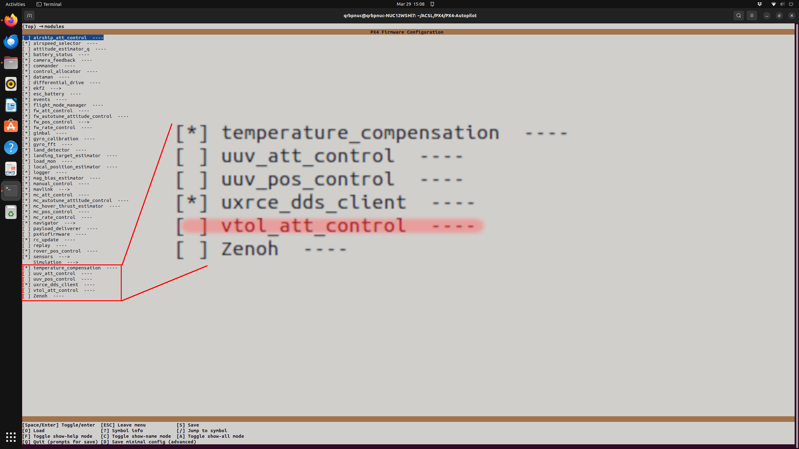

*[Figure 2](#figure-2): PX4-Autopilot firmware configurator screen 2*

You can now proceed with compiling the firmware by running,

```bash
    make px4_fmu-v6c
```

Now, if the firmware compiles without any issues, you need to do the following to uninstall the `Modemmanager`. Run:

```bash
    sudo usermod -a -G dialout $USER
    sudo apt-get remove modemmanager -y
    sudo apt install gstreamer1.0-plugins-bad gstreamer1.0-libav gstreamer1.0-gl -y
    sudo apt install libfuse2 -y
    sudo apt install libxcb-xinerama0 libxkbcommon-x11-0 libxcb-cursor0 -y
```

Now, connect the Pixhawk 6C or any other Pixhawk you might be using (with the correct firmware version compiled, of course) and run the following to upload the firmware:

```bash
    make px4_fmu-v6c upload
```

Follow the prompts on the terminal window and once completed, the new firmware is uploaded.

> **Note:** Sometimes the `make px4_fmu-v6c upload` command could freeze. Then do not cancel the command on the terminal and just unplug and re-plug the Pixhawk. This solves the issue. Otherwise, at other points, the terminal will prompt you to unplug and re-plug the Pixhawk.

You can then connect the Pixhawk to QGroundControl and check if the version is `v1.15` or `v1.15dev`.

> **Note:** Google the QGroundControl installation procedure for your specified platform. Once done, you can connect the Pixhawk using a USB cable. You can check the firmware version by following the PX4 dev guide.


## 1.2 Parameters setting

If the vehicle is in *Offboard mode* after some time (by default 10s) and auto-disarms itself, and you want to avoid this, you have to set the following parameter as such:

```bash
    COM_DISARM_PRFLT = -1.0
```


To be more precise, any negative value would work.
To avoid the vehicle automatically disarming itself after landing (or after it thinks it has landed but it is still in mid-air), set the following parameter as such:

```bash
    COM_DISARM_LAND = -1.0
```

Now setup the arm switch as a momentary switch

```bash
    COM_ARM_SWISBTN = Enabled
```

To set up the Pixhawk for ROS2 communication with the Odroid, set the following parameters:

```bash
    UXRCE_DDS_CFG = TELEM 2
```

Reboot the vehicle.

```bash
    SER_TEL2_BAUD = 921600 8N1
    MAV_1_CONFIG = Disabled
    MAV_2_CONFIG = Disabled
```

### 1.2.1 GPS configuration

```bash
    SYS_HAS_GPS = Enabled
    SYS_HAS_MAG = 1
    UAVCAN_ENABLE = Sensors Automatic Config
    EKF2_HGT_REF = GPS
    EKF2_MAG_TYPE = Automatic
```

If using `CAN` for GPS, enable this:

```bash
    UAV_CAN_PUB_RTCM = Enabled
```

Fuse all the data, but **if** you are having drift, set this setting as follows and try again:

```bash
    EKF2_GPS_CTRL = No velocity fusion, no Altitude fusion
```

Set the height reference to barometer **if** you are having drift with `GPS` as the height reference:

```bash
    EKF2_HGT_REF = BARO
```

You might have to play around with the following, but for `HERE-3 RTK`, these worked:

```bash
    EKF2_GPS_P_NOISE = 0.05
    EKF2_GPS_V_NOISE = 0.03
    EKF2_TAS_GATE = 3.0SD
    EKF2_TAU_POS = 0.25s
    EKF2_TAU_VEL = 0.25s
```

### 1.2.2 VICON configuration

```bash
    SYS_HAS_GPS = Disabled
    SYS_HAS_MAG = 0
    UAVCAN_ENABLE = Disabled
    EKF2_HGT_REF = Vision
    EKF2_EV_CTRL = 11
    EKF2_MAG_TYPE = Automatic
    EKF2_RNG_CTRL = Disable range fusion
    EKF2_TAU_POS = 0.1
    EKF2_TAU_VEL = 0.1
    EKF2_EVP_NOISE = 0.01
    EKF2_EVV_NOISE = 0.01
    EKF2_EVA_NOISE = 2.87
    EKF2_EV_NOISE_MD = Default
```

From: [PX4 EKF Tuning Guide](https://docs.px4.io/main/en/advanced_config/tuning_the_ecl_ekf.html)

# 2 Flashing the OS to the Odroid M1S 

Things you will need to flash the OS to the ODroid M1S

- ODroid M1S
- USB A - Micro B OTG cable
- Power module for the ODroid or a USB A - C cable (you can power the odroid from your groundstation PC)
- [Balena Etcher](https://etcher.balena.io/). We recommend you download the executable version
- SD card (8GB or above)

Procedure:

1. The first step would be to download the `ODROID-M1S_EMMC2UMS.img` and flash it to the SD card. You can use Balena Etcher to do so.
2. Plug the SD card with the newly flashed image into the SD card slot of the ODroid M1S. Then power the board using the power adapter or the USB A - C cable. 
3. Plug in the USB A - Micro B OTG cable. This enables us to ODroid M1S as a mass storage device. i.e., it lets us write directly to the eMMC on board.
4. Now open Balena Ether again and flash this image,  
`
    ubuntu-20.04-gnome-desktop-odroidm1s-20231030.img.xz
`
onto the eMMC directly. The image is a compressed one, Balena Etcher can decompress as it is writing to the eMMC.

5. Once it is done flashing the new image onto the eMMC. Disconnect all the cables to the ODroid M1S and make sure it is unpowered.
6. Remove the SD card.
7. Power the ODroid again and connect a mouse and keyboard and an HDMI cable. 

# 3 Setting up the ODroid M1S with Desktop GUI

## 3.1 Initial setup:

On bootup after flashing the new Ubuntu 20.04 OS as referenced in [Section 2](#2-flashing-the-os-to-the-odroid-m1s)
, login using the default password `odroid`. You will then be greeted with the following three dialog boxes as shown in [Figure 3](#figure-3). Pick the options highlighted in red.

#### Figure 3
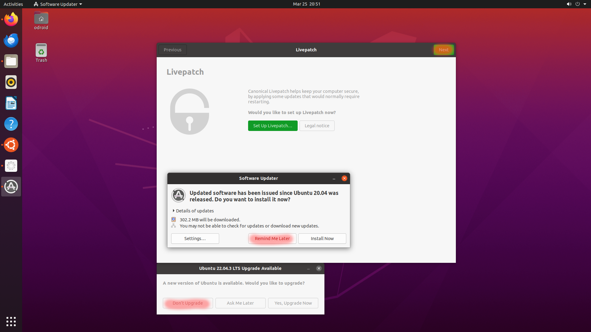  

*[Figure 3](#figure-3): Dialog box on startup of newly flashed ODroid M1S with Ubuntu 20.04*

> **Note:** Dialog box called **Livepatch** will always show up. **Software updater** and **Ubuntu upgrade** option dialog boxes might not. Do   not worry if they do not. If they do show up, choose the options highlighted in red.

Proceeding with the **Livepatch** dialog box after choosing the option highlighted in red, you will be greeted with the next steps. Do as instructed in [Figure 4](#figure-4) and [Figure 5](#figure-5). We do not want our location visible as it breaks some packages on runtime if we lack internet (which we will) while testing the drone and running experiments. We also do not want to send data back  to Ubuntu. This is done to reduce the number of background tasks.

#### Figure 4
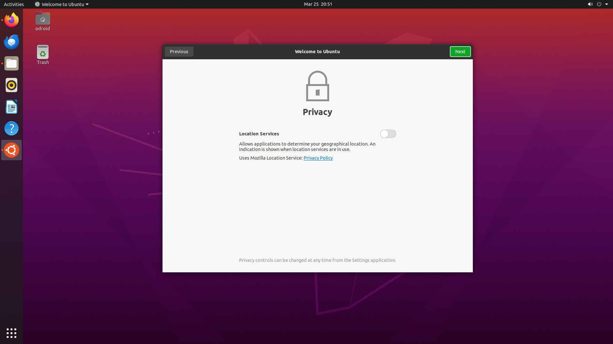 

*[Figure 4](#figure-4): Privacy Options*

#### Figure 5
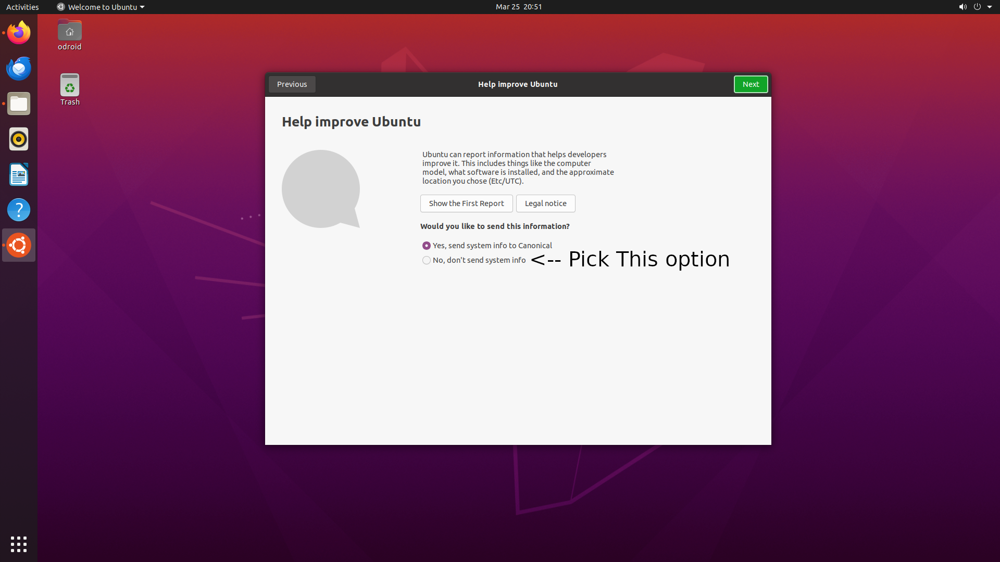 

*[Figure 5](#figure-5): Send debug data options*

## 3.2 Set time

1. Go to Settings as shown in [Figure 6](#figure-6).

2. Go to time and date as shown in [Figure 7](#figure-7).

3. Make sure the ethernet cable is plugged in.

4. Set the time zone to New York time as shown in [Figure 8](#figure-8) and close the dialog box. Recheck the time just to be sure. This is done so that when we update or install packages from the server, we don't run into a time discrepancy with the repositories.

5. Proceed to [Section 3.4](#34-update-the-odroid-m1s).

---

#### Figure 6
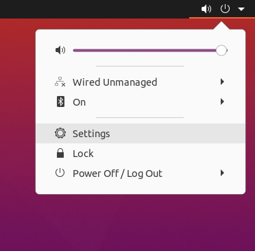

*[Figure 6](#figure-6): How to access settings*

#### Figure 7
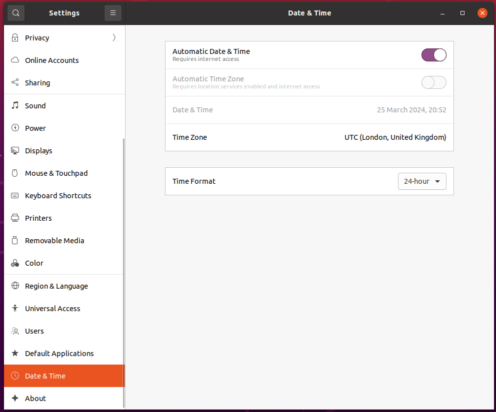

*[Figure 7](#figure-7): Go to Date and Time option*

#### Figure 8
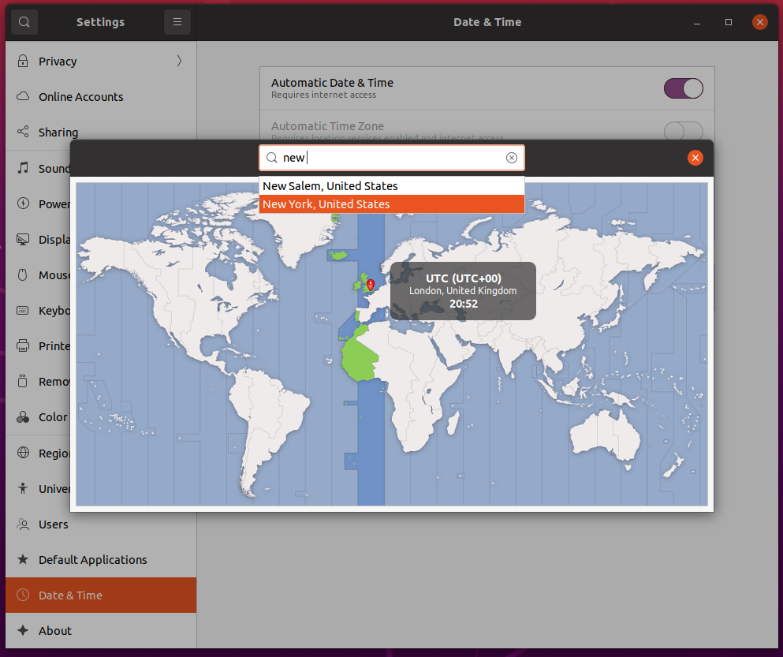

*[Figure 8](#figure-8): Set to NY Time*


## 3.3 Configure Automatic Login for when Odroid is powered on

1. Open the *Activities* overview in the top left corner and start typing "Users".

2. Click *Users* to open the panel.

3. Press *Unlock* in the top right corner and type the password ("odroid") when prompted.

4. Switch the *Automatic Login* switch to on.

## 3.4 Update the ODroid M1S

```bash
    sudo apt-get update
    sudo apt-get upgrade
```
Enter `Y` and press `Enter` for the upgrade process to start. Now there might be an error that is thrown for the mail-gpu package

```bash
    Errors were encountered while processing:
        /tmp/apt-dpkg-install-9jH1aQ/074-libmali-bifrost-g52-r25p0-wayland_5%3a1.9-5+202403161939~focal_arm64.deb
    E: Sub-process /usr/bin/dpkg returned an error code (1)
```

Ignore it and run the following code again and attempt to fix it with the `--fix-missing` option.

```bash
    sudo apt-get upgrade --fix-missing
```

If the error still persists, ignore it and proceed. Reboot the system.

## 3.5 Install git and nano

Run the following code to install nano and git

```bash
   sudo apt-get install git nano
```

## 3.6 Install "libasio-dev" Package
   
This package is needed for the UDP communication for VICON.

```bash
    sudo apt-get update -y
    sudo apt-get install -y libasio-dev
```

## 3.7 Setting the RTC clock

1. Now that the time is set to NYC time as shown in [Figure 8](#figure-8). reboot the system by either typing `sudo reboot` in the terminal or using the GUI option.

2. Now install the RTC battery at the back of the board. The RTC battery plug is keyed and therefore can only be installed one way. Please be careful while performing the installation as the RTC plug is fragile. Once you have installed the battery, use the double-sided tape provided at the back of the battery to stick it to the back of the board. Please be sure to find a space that is not occupied by traces on the PCB or other components and avoid the rectangular space already allocated for PCIE slot.

3.  Once that is done, the RTC circuit should be running. Run the following command in the terminal, 
`bash
    sudo hwclock -w -f /dev/rtc0
`
This should write our system time to the rtc clock. Once that is done. Please go back to the *Date \& Time* options in the settings and switch off the option to sync from the internet (*Automatic Date \& Time* option). This will make sure that the system does not look for a network connection upon boot. You can refer to [Figure 9](#figure-9) for the setting.

4. Now run the following in the terminal to check if your time and the rtc time are sync'd.
`sudo hwclock -r; date`
Check if the date and time on the first line matches the second line of the output.

5. The final step is to write some code that makes the system time sync to the time of the RTC clock upon boot and not the internet. Run the following code in the terminal. `sudo nano /etc/rc.local`
This will open up a file in nano. Scroll down all the way to the end and add the following before the `exit 0` line.
    ```bash
        if [ -f /aafirstboot ]; then /aafirstboot start ; fi

        hwclock -s -f /dev/rtc0

        exit 0    ← *already there*
    ```
    Now press `ctrl+o` to save the changes, then `ctrl+x` to exit the file.

6. You can reboot the system by typing in `sudo reboot`.

7. Your RTC should now be configured. You can remove the ethernet cable and boot after 5 minutes to check if the time is right just for sanity check.

    #### Figure 9
    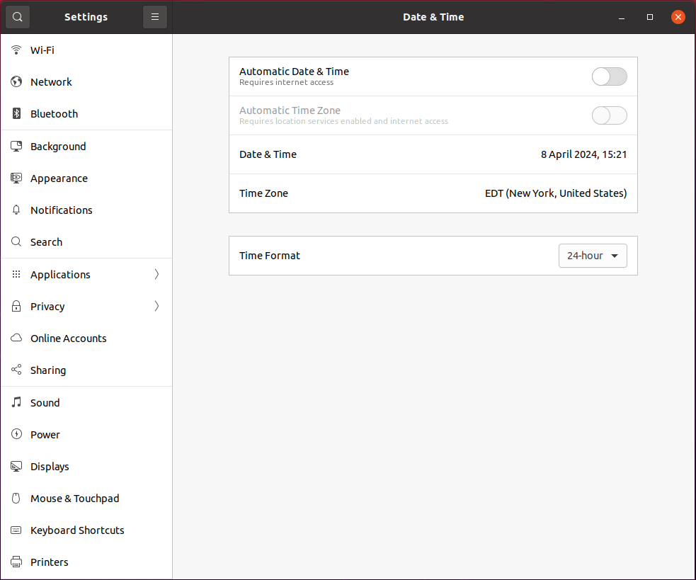

    *[Figure 9](#figure-9): How to access settings*

## 3.8 Check For USB communication

Install the USB drivers for communication with the following commands

```bash
    sudo apt-get update -y
    sudo apt-get install usbutils -y
```

With the Wifi and the FTDI usb-uart module plugged in, run the following command:

```bash
    lsusb
```

This should display the USB devices that are connected to the ODroid M1S. Make sure a "Realtek" wifi module device is present and a "FTDI" serial device are present. Next check if serial communication is ok (/dev/ttyUSB0 is present) by running:

```bash
    ls -al /dev/ttyUSB*
```

This should list some "/dev/ttyUSB0" or "/dev/ACM0" to be node to be present (usually the serial devices have the identifier 0 at the end). If not. Then check if the modules "usbserial" and "ftdi_sio" are there by running:

```bash
    lsmod
```

If they are not there, do the following:

```bash
    cd /etc/modules-load.d/
    sudo nano modules.conf
```

Add the following line to the file and then save and exit

```bash
    usbserial
```

Create an additional file:

```bash
    sudo nano ftdi_sio.conf
```

Add the following line to the file and then save and exit

```bash
    ftdi_sio
```

Now the modules should automatically load at each reboot. Now reboot

```bash
    sudo reboot
```

and once you login, go to a terminal and run 

```bash
    lsmod
```
to make sure the "usbserial" and "ftdi_sio" modules are present.

## 3.9 Install CMake Package

Prepare for installation

```bash
    sudo apt update && \
    sudo apt install -y software-properties-common lsb-release && \
    sudo apt clean all
```

Obtain a copy of kitware's signing key.

```bash
    wget -O - https://apt.kitware.com/keys/kitware-archive-latest.asc 2>/dev/null | gpg --dearmor - | sudo tee /etc/apt/trusted.gpg.d/kitware.gpg >/dev/null
```
Add kitware's repository to your sources list for Ubuntu

```bash
    sudo apt-add-repository "deb https://apt.kitware.com/ubuntu/ $(lsb_release -cs) main"
```
As an optional step, is recommended that we also install the kitware-archive-keyring package to ensure that Kitware's keyring stays up to date as they rotate their keys.

```bash
    sudo apt update
    sudo apt install kitware-archive-keyring
    sudo rm /etc/apt/trusted.gpg.d/kitware.gpg
    sudo apt-get update
```

If running `sudo apt-get update` gets the following error:

```bash
    Err:7 https://apt.kitware.com/ubuntu bionic InRelease
        The following signatures couldnt be verified because the public key is not available: NO_PUBKEY "{KEY}"
        Fetched 11.0 kB in 1s (7552 B/s)
```

Copy the public key - "{KEY}" for example 6AF7F09730B3F0A4 and run this command (make sure to replace the example key with the key that is shown for you):

 ```bash
    sudo apt-key adv --keyserver keyserver.ubuntu.com --recv-keys 6AF7F09730B3F0A4
 ```

Finally we can update and install the cmake package.

 ```bash
    sudo apt update
    sudo apt install cmake
```

After installation check if the latest version is installed

```bash
    cmake --version
```

Make sure the version is at least more than version "3.20".


## 3.10 Setting up the Access Point

Now, to create the access point for us to ssh into the ODroid M1S, we use a GUI tool to do so. It is built on the old `create_ap` repository by oblique but is up to date and works with our 5BK wifi module from Hardkernel. First, we install some dependencies:

```bash
    sudo apt install -y libgtk-3-dev build-essential gcc g++ pkg-config make hostapd libqrencode-dev libpng-dev
```

Then we go to our home folder and clone the repository and install,

```bash
    # go to home
    cd

    # clone repository
    git clone https://github.com/lakinduakash/linux-wifi-hotspot

    # cd into repository
    cd linux-wifi-hotspot

    # build the binaries
    make

    # install
    sudo make install
```

Now you can launch the utility by typing the following in the terminal

```bash
    wihotspot
```

Now you will see a dialog box open as shown in [Figure 10](#figure-10).

> **Note:** Choose your SSID and Password as you please. We recommend using `odroid_m1s_ap` followed by a number that is not taken up by any other ODroid M1S. For example, I have the second ODroid M1S in the lab and have thus picked the SSID `odroid_m1s_ap2`. We also strongly recommend setting the password as the same as the SSID. You can also change the gateway IP by enabling the Gateway option and setting an IP. We recommend you do not do so.  
>  
> While SSH-ing into the ODroid from the groundstation, you might run into some error that says that the MAC or KEY is not recognized. If you are on Windows, go to `C:\Users\<username>\.ssh`, open `known_hosts` using Notepad, delete all the contents in the file and save it. Now try SSH-ing back and you can. On Ubuntu, run the command that shows up on the terminal.

#### Figure 10
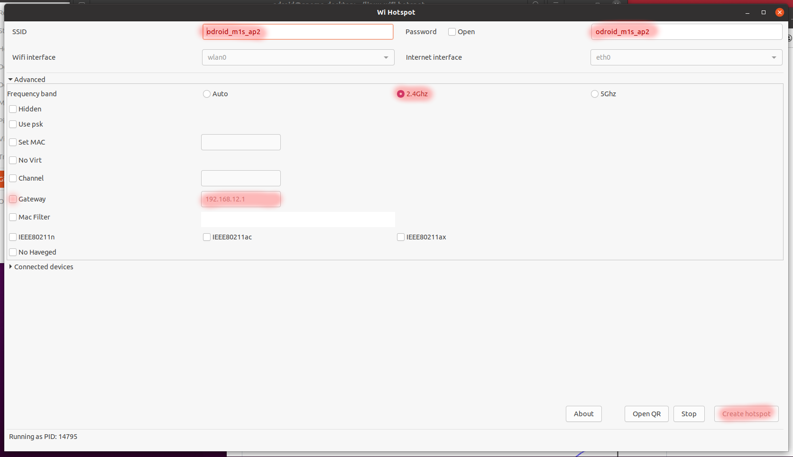

*[Figure 10](#figure-10): Settings for access point*

Now to enable the accesspoint on startup type in,

```bash
    sudo systemctl enable create_ap
```
Reboot the system and check if you can find your access point and are able to ssh in. Type in your ground station computer:

```bash
    ssh odroid@192.168.12.1
```

By default, the gateway is *192.168.12.1*, If you have changed it, enter that gateway ip. The default password is: *odroid*.

## 3.11 Installing ROS2 Foxy


Make sure you have a locale which supports UTF-8. If you are in a minimal environment (such as a docker container), the locale may be something minimal like POSIX. We test with the following settings. However, it should be fine if you’re using a different UTF-8 supported locale. We are not in a minimal environment or on a docker so we should be fine. Just run the following and check if nothing but UTF-8 is populated in the properties shown.

```bash
    locale
```

 If you find any inconsistencies or for your peace of mind (optional) run the following to be sure.

```bash
    sudo apt update && sudo apt install locales
    sudo locale-gen en_US en_US.UTF-8
    sudo update-locale LC_ALL=en_US.UTF-8 LANG=en_US.UTF-8
    export LANG=en_US.UTF-8
```

 Now you will need to add the ROS2 apt repository to your system. First ensure that the Ubuntu Universe repository is enabled.

```bash
    sudo apt install software-properties-common
    sudo add-apt-repository universe
```

 Now add the ROS2 GPG key with apt.

```bash
    sudo apt update && sudo apt install curl -y
    sudo curl -sSL https://raw.githubusercontent.com/ros/rosdistro/master/ros.key -o /usr/share/keyrings/ros-archive-keyring.gpg
```

 Then add the repository to your sources list,

```bash
    echo "deb [arch=$(dpkg --print-architecture) signed-by=/usr/share/keyrings/ros-archive-keyring.gpg] http://packages.ros.org/ros2/ubuntu $(. /etc/os-release && echo $UBUNTU_CODENAME) main" | sudo tee /etc/apt/sources.list.d/ros2.list > /dev/null
```

 Update your apt repository caches after setting up the repositories,

```bash
    sudo apt udpate
```

 ROS2 packages are built on frequently updated Ubuntu systems. It is always recommended that you ensure your system is up to date before installing new packages.

```bash
    sudo apt upgrade
```

Now, you have a choice, you can either install the bare-bones version of ROS2 (for less storage space and some speed) or what we install, the full desktop version of ros (recommended). The following commands are used (note that you have to pick one or the other, cannot run both!):

```bash
    # Desktop Install (Recommended): ROS, RViz, demos, tutorials.
    sudo apt install ros-foxy-desktop python3-argcomplete

    # ROS-Base Install (Bare Bones): Communication libraries, message packages, command line tools. No GUI tools.
    sudo apt install ros-foxy-ros-base python3-argcomplete
```

 Now install the ROS2 development tools for compiling and managing packages

```bash
    sudo apt install ros-dev-tools
```

 Now to run a simple test. EITHER ssh into the ODroid in two terminal windows on your groundstation pc OR open two terminal windows on your ODroid itself and run the following:

```bash
    # In window 1:
    source /opt/ros/foxy/setup.bash
    ros2 run demo_nodes_cpp talker
```

```bash
    # In window 2:
    source /opt/ros/foxy/setup.bash
    ros2 run demo_nodes_py listener
```

 You should see the talker saying that it’s Publishing messages and the listener saying I heard those messages. This verifies both the C++ and Python APIs are working properly. Now we can move on to building the communication sub-module for the ODroid.

Now, we don’t want to have to source the setup file every time we open a new shell, we can add the command to out shell startup script, this makes it easier while we ssh in:

```bash
    echo "source /opt/ros/foxy/setup.bash" >> ~/.bashrc
```

After running the above command, run this,

```bash
    printenv | grep -i ROS
```

you should get an output similar to this

```bash
    ROS_VERSION=2
    ROS_PYTHON_VERSION=3
    AMENT_PREFIX_PATH=/opt/ros/foxy
    PYTHONPATH=/opt/ros/foxy/lib/python3.8/site-packages
    LD_LIBRARY_PATH=/opt/ros/foxy/opt/yaml_cpp_vendor/lib:/opt/ros/foxy/opt/rviz_ogre_vendor/lib:/opt/ros/foxy/lib/aarch64-linux-gnu:/opt/ros/foxy/lib
    ROS_LOCALHOST_ONLY=0
    PATH=/opt/ros/foxy/bin:/usr/local/sbin:/usr/local/bin:/usr/sbin:/usr/bin:/sbin:/bin:/usr/games:/usr/local/games:/snap/bin
    ROS_DISTRO=foxy    
```

Now, the bash shell will automatically source the packages for ROS2 foxy and we do not have to source it every time we try to do anything with ROS2 on the ODroid M1s. Now to account for some deprecated package errors run this command

```bash
    sudo apt-get install python3-testresources
    sudo apt-get install python3-pip
    pip3 install setuptools==58.2.0
    sudo reboot
```

## 3.10 Install μXRCE-DDS

PX4 uses μXRCE-DDS middle-ware to allow uORB messages to be published and subscribed on a companion computer as though they were ROS 2 topics. This provides a fast and reliable integration between PX4 and ROS 2, and makes it much easier for ROS 2 applications to get vehicle information and send commands. 

The μXRCE-DDS middle-ware consists of a client running on PX4 and an agent running on the companion computer, with bi-directional data exchange between them over a serial or UDP link. The agent acts as a proxy for the client, enabling it to publish and subscribe to topics in the global DDS data space. 

In order for PX4 uORB topics to be shared on the DDS network you will need μXRCE-DDS client running on PX4, connected to the μXRCE-DDS agent running on the companion. The PX4 μxrce_dds_client publishes to/from a defined set of uORB topics to the global DDS data space. The eProsima μXRCE-DDS agent runs on the companion computer and acts as a proxy for the client in the DDS/ROS 2 network. 

The agent itself has no dependency on client-side code and can be built and/or installed independent of PX4 or ROS. Code that wants to subscribe/publish to PX4 does have a dependency on client-side code; it requires uORB message definitions that match those used to create the PX4 μXRCE-DDS client so that it can interpret the messages.

> **Note**: *μXRCE* is also sometimes referred to as *micro XRCE*


 Thus we have a few options to build the μXRCE stack. We can either compile from source or we can compile inside a ROS2 build space. It doesn't matter. Compiling from source is slightly better as we can modularize it and get the latest version of the code and stack. Another advantage is transferring code over ssh to and from the ground station. Compiling from source and installing it as a separate shared library helps us keep our code stack light and also makes sure we have lesser components to break, therefore the instructions are provided for that. Run the following commands in a terminal window on the ODroid M1S:

```bash
    git clone https://github.com/eProsima/Micro-XRCE-DDS-Agent.git
    cd Micro-XRCE-DDS-Agent
    mkdir build
    cd build
    cmake ..
    make -j4
    sudo make install
    sudo ldconfig /usr/local/lib/
```

> **Note**: `make -j4` tells the compiler to run simultaneous processes in the background. We can do up to 4 with the ODroid M1S.Your mileage may vary when using a different board. Look up how many concurrent processes can be run based on the number of CPU cores for your board and proceed accordingly.

Now that we have set up the companion computer side, we can move on to the Pixhawk setup and finally connecting the two and read/write data.

## 3.13 Creating a system rule for the Pixhawk
We want to create a separate mounting point in the "tty" node of the Linux subsystem to make sure the serial communication is robust in terms of mounting points.

> **Note**: Here we proceed with only *one* FTDI to USB cable as pictured in [Figure](#figure-) to connect the Pixhawk 6C and the ODroid M1S. This cable enables UART communication which will be setup later on the ODroid M1S. If we have more than one *FTDI to USB* cable, make sure that the serial cable that connects Pixhawk to the Odroid is plugged in as last as this will ensure that the alias is set to the appropriate port as described in [Section 3.13](#313-creating-a-system-rule-for-the-pixhawk).

On Linux the default name of a USB FTDI would be like `\dev\ttyUSB0`. If you have a second FTDI linked on the USB, it will registered as `\dev\ttyUSB1`. To avoid the confusion between the first plugged and the second plugged, create a symlink from `ttyUSBx` to a friendly name, depending on the Vendor and Product ID of the USB device.

Using the following command we can get the vendor and product IDs.

```bash
    lsusb
```

The output of `lsusb` related to the serial connection would look something like:

```bash
    Bus 005 Device 006: ID 0403:6001 Future Technology Devices International, Ltd FT232 Serial (UART) IC
```

Therefore, we can create a new UDEV rule. To do so run the following:

```bash
    cd /etc/udev/rules.d/
    sudo nano 99-pixhawk.rules
```

in the file that we just opened called `/etc/udev/rules.d/99-pixhawk.rules`, fill it with the following content, changing the *idVendor* and *idProduct* to yours. In this case:

```bash
    SUBSYSTEM=="tty", ATTRS{idVendor}=="0403", ATTRS{idProduct}=="6001", SYMLINK+="ttyPixhawk"
```

> **Note:** use `ctrl + o` to write the file and then `ctrl + x` to exit the file.


Be sure to add yourself in the `tty` and `dialout` groups via `usermod` to avoid having to execute scripts as root.

```bash
    sudo usermod -a -G tty odroid
    sudo usermod -a -G dialout odroid
```

> **Note**:You can reboot by typing in `sudo reboot` in the terminal window.

Finally, after a reboot you can be sure to know which device is what and put `/dev/ttyPixhawk` instead of `/dev/ttyUSB0` in your scripts.

## 3.14 Deleting unnecessary packages

Deleting unnecessary packages has a tangible impact on the maximum achievable speed to execute the flightstack. More specifically, it has a huge impact on the repeatability/variance of the execution time. To get rid of the unnecessary packages, copy the following in a file called
`ubuntu-bloat-removal.sh`:

```bash
    sudo apt-get remove                   \
    aisleriot                             \
    brltty                                \
    duplicity                             \
    empathy                               \
    empathy-common                        \
    example-content                       \
    gnome-contacts                        \
    gnome-mahjongg                        \
    gnome-mines                           \
    gnome-orca                            \
    gnome-sudoku                          \
    gnome-video-effects                   \
    landscape-common                      \
    libreoffice-avmedia-backend-gstreamer \
    libreoffice-base-core                 \
    libreoffice-calc                      \
    libreoffice-common                    \
    libreoffice-core                      \
    libreoffice-draw                      \
    libreoffice-gnome                     \
    libreoffice-gtk                       \
    libreoffice-impress                   \
    libreoffice-math                      \
    libreoffice-ogltrans                  \
    libreoffice-pdfimport                 \
    libreoffice-style-galaxy              \
    libreoffice-style-human               \
    libreoffice-writer                    \
    libsane                               \
    libsane-common                        \
    python3-uno                           \
    rhythmbox                             \
    rhythmbox-plugins                     \
    rhythmbox-plugin-zeitgeist            \
    sane-utils                            \
    shotwell                              \
    shotwell-common                       \
    telepathy-gabble                      \
    telepathy-haze                        \
    telepathy-idle                        \
    telepathy-indicator                   \
    telepathy-logger                      \
    telepathy-mission-control-5           \
    telepathy-salut                       \
    totem                                 \
    totem-common                          \
    totem-plugins                         \
    printer-driver-brlaser                \
    printer-driver-foo2zjs                \
    printer-driver-foo2zjs-common         \
    printer-driver-m2300w                 \
    printer-driver-ptouch                 \
    printer-driver-splix		      \
    thunderbird
```

Make the script executable 

```bash
    chmod +x ubuntu-bloat-removal.sh
```

and run the script

```bash
    ./ubuntu-bloat-removal.sh
```

In the case that now USB pen-drives cannot be accessed anymore:

Check if your user is a member of the `plugdev` group

```bash
    id odroid
```

If `plugdev` is not listed and you need to add your user to the `plugdev` group, you can use the following command:

```bash
    sudo usermod -aG plugdev odroid
```

This should solve the issue, and you should be able now to access USB pen-drives.

# 4 Setting up the ODroid M1S as a server with ROS2 Humble

When you plug the ODroid M1s to power and connect it to a monitor and keyboard for the first time, you will be greeted with the following screen as shown in [Figure 11](#figure-11). Pick option `3` which is the server option and let it run through the setup

#### Figure 11
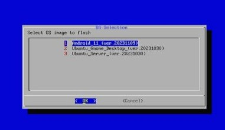

*[Figure 11](#figure-11): Checking uXRCE-DDS client status*

Be sure to add yourself in the `tty` and `dialout` groups via `usermod` to avoid having to execute scripts as root.

```bash
    sudo usermod -a -G tty odroid
    sudo usermod -a -G dialout odroid
```

## 4.1 Check the timezone

Plug in the Ethernet and check the time zone by typing in

``` bash
    date
```

If the timezone is not what you expect it to be, type in the following

```bash
    sudo dpkg-reconfigure tzdata
```

A dialogue box will pop up with the various countries and time zones. Use the arrow keys to navigate and the Enter key to select, then verify that the time zone is set correctly with the `date` command.

## 4.2 Update the ODroid

```bash
    sudo apt-get -y update
    sudo apt-get -y upgrade
```

 Enter the password `odroid` when prompted.

 ## 4.3 Install git and nano

Run the following code to install nano and git

```bash
    sudo apt-get -y install git nano
```
## 4.4 Install ""libasio-dev" Package

This package is needed for the UDP communication for VICON.

```bash
    sudo apt-get update -y
    sudo apt-get install -y libasio-dev
```

## 4.5 Install ""lsusb" Package

This package is needed for USB interfaces like our ftdio USB device

```bash
    sudo apt-get install usbutils
```

## 4.6 Setting the RTC clock 


1. Now that the time is set to NYC time in the previous steps (or your desired time zone). reboot the system by either typing \texttt{sudo reboot} in the terminal.

2. Now install the RTC battery at the back of the board. The RTC battery plug is keyed and, therefore, can only be installed one way. Please be careful while performing the installation, as the RTC plug is fragile. Once you have installed the battery, use the double-sided tape provided at the back of the battery to stick it to the back of the board. Please be sure to find a space that is not occupied by traces on the PCB or other components and avoid the rectangular space already allocated for PCIE slot.

3.  Once that is done, the RTC circuit should be running. Run the following command in the terminal, 
`
    sudo hwclock -w -f /dev/rtc0
`

    This should write our system time to the rtc clock. Once that is done. Now we want to run the following command to switch off the autosyning of time to the server, `sudo timedatectl set-ntp false`


4. Now run the following in the terminal to check if your time and the rtc time are sync'd.
`sudo hwclock -r; date`
Check if the date and time on the first line matches the second line of the output.

5. The final step is to write some code that makes the system time sync to the time of the RTC clock upon boot and not the internet. Run the following code in the terminal. `sudo nano /etc/rc.local`
This will open up a file in nano. Scroll down all the way to the end and add the following before the `exit 0` line.
    ```bash
        if [ -f /aafirstboot ]; then /aafirstboot start ; fi

        hwclock -s -f /dev/rtc0

        exit 0    ← *already there*
    ```
    Now press `ctrl+o` to save the changes, then `ctrl+x` to exit the file.

6. You can reboot the system by typing in `sudo reboot`.

7. Your RTC should now be configured. You can remove the ethernet cable and boot after 5 minutes to check if the time is right just for sanity check.

## 4.7 Check for USB communication

With the Wifi and the FTDI usb-uart module plugged in, run the following command:

```bash
    lsusb
```

This should display the USB devices that are connected to the ODroid M1S. Make sure a "Realtek" wifi module device is present and a "FTDI" serial device are present. Next check if serial communication is ok (/dev/ttyUSB0 is present) by running: 

```bash
    ls -al /dev/ttyUSB*
```

This should list some "/dev/ttyUSB0" or "/dev/ACM0" to be node to be present (usually the serial devices have the identifier 0 at the end). If not. Then check if the modules "usbserial" and "ftdi_sio" are there by running: 

```bash
    lsmod
```

If they are not there, do the following:

```bash
    cd /etc/modules-load.d/
    sudo nano modules.conf
```

Add the following line to the file and then save and exit

```bash
    usbserial
```

Create an additional file:
```bash
    sudo nano ftdi_sio.conf
```

Add the following line to the file and then save and exit

```bash
    ftdi_sio
```

Now the modules should automatically load at each reboot. Now reboot

```bash
    sudo reboot
```

and once you login, go to a terminal and run 

```bash
    lsmod
```

to make sure the "usbserial" and "ftdi_sio" modules are present.

## 4.8 Install latest CMake Package

Prepare for installation

```bash
    sudo apt update && \
    sudo apt install -y software-properties-common lsb-release && \
    sudo apt clean all
```

Obtain a copy of kitware's signing key.

```bash
    wget -O - https://apt.kitware.com/keys/kitware-archive-latest.asc 2>/dev/null | gpg --dearmor - | sudo tee /etc/apt/trusted.gpg.d/kitware.gpg >/dev/null
```

Add kitware's repository to your sources list for Ubuntu

```bash
    sudo add-apt-repository "deb https://apt.kitware.com/ubuntu/ $(lsb_release -cs) main"
```

As an optional step, is recommended that we also install the kitware-archive-keyring package to ensure that Kitware's keyring stays up to date as they rotate their keys.

```bash
    sudo apt update
    sudo apt install kitware-archive-keyring
    sudo rm /etc/apt/trusted.gpg.d/kitware.gpg
    sudo apt-get update
```

If running "sudo apt-get update" gets the following error:

```bash
Err:7 https://apt.kitware.com/ubuntu bionic InRelease
    The following signatures couldnt be verified because the public key is not available: NO_PUBKEY "{KEY}"
    Fetched 11.0 kB in 1s (7552 B/s)
```

Copy the public key - "{KEY}" for example 6AF7F09730B3F0A4 and run this command (make sure to replace the example key with the key that is shown for you):

```bash
    sudo apt-key adv --keyserver keyserver.ubuntu.com --recv-keys 6AF7F09730B3F0A4
```

Finally we can update and install the cmake package.

```bash
    sudo apt update
    sudo apt install cmake
```

After installation check if the latest version is installed

```bash
    cmake --version
```

Make sure the version is at least more than version "3.20".

 ## 4.9 Setting up the Access Point

In the previous installation with GUI Desktop, we used a GUI tool to set up our access point, here we will do it a bit differently. The package which is built on the old `create_ap` repository by oblique (but is up to date) works with our 5BK wifi module from Hardkernel. First, we install some dependencies:

```bash
    sudo apt install -y libgtk-3-dev build-essential gcc g++ pkg-config make hostapd libqrencode-dev libpng-dev wireless-tools
```
Install the dependencies for the wifi drivers

```bash
    sudo apt install iw dnsmasq iptables -y
```

Now navigate to the home folder and use the following commands to clone and install the package

```bash
    cd
    git clone https://github.com/lakinduakash/linux-wifi-hotspot
    cd linux-wifi-hotspot/src/scripts
```

Now, we need to modify the settings of the `create_ap.conf` to put in our wifi name and password before installation. Navigate to the folder using,

```bash
    cd linux-wifi-hotspot/src/scripts/
    nano create_ap.conf
```

and modify the following as you please

```bash
    SSID=MyAccessPoint
    PASSPHRASE=12345678
```

to the following

```bash
    SSID=sqrbp_ap
    PASSPHRASE=sqrbp_ap
```

> **Note**: Choose your SSID and Password as you please. We recommend using `NameOfPlatform_ap`. For example, I have the ODroid M1S connected to the small Quad-Rotor-Biplane platform and have thus picked the SSID `sqrbp_ap`. We also strongly recommend setting the password as the same as the SSID.

Type in the following to set ourselves up for wifi.

```bash
    sudo apt-get install linux-headers-$(uname -r)$
```

this installs the headers for our wifi module. After the installation, reboot using `sudo reboot now` and create a service for running our wifi adapter as `wlan0`.

```bash
    sudo nano /etc/systemd/system/wlan0.service
```

Add the following content:

```bash
    [Unit]
    Description=Bring up wlan0 interface
    Wants=network.target
    Before=network.target
    
    [Service]
    Type=oneshot
    ExecStart=/sbin/ifconfig wlan0 up
    RemainAfterExit=yes
    
    [Install]
    WantedBy=multi-user.target    
```

Save and close the file using `ctrl + o` and `ctrl + x`. Enable the service to start at boot:

```bash
    sudo systemctl enable wlan0.service
```

Verify that the `wlan0` is showing up

```bash
    sudo iwconfig
```

and turn on the `wlan0`

```bash
    sudo ifconfig wlan0 up
```

reboot using `sudo reboot now` and make sure our `wlan0` connection is up, type

```bash
    ifconfig
```

and see if the `wlan0` shows up. You can now proceed to install using,

```bash
    sudo make install-cli-only
```

Now create the `WPA + WPA2 passphrase` for your access point by typing in the following

```bash
    sudo create_ap --no-virt wlan0 eth0 sqrbp_ap sqrbp_ap
```

Now to enable the accesspoint on startup type in,

```bash
    sudo systemctl enable create_ap
```

Reboot the system and check if you can find your access point and are able to ssh in. Type in your ground station computer:

```bash
    ssh odroid@192.168.12.1
```

By default, the gateway is `192.168.12.1`. The default password is: `odroid`.

> **Note**: While SSH-ing into the ODroid from the groundstation, you might run into some error that say that the MAC or KEY is not recognized. If you are on windows go to `C:\Users\<username>\.ssh`, open `known_hosts` using notepad, delete all the contents in the file and save it. Now try SSH-ing back and you can. On Ubuntu, run the command that shows up on the terminal.


## 4.10 Installing ROS2Humble

Make sure you have a locale which supports UTF-8. If you are in a minimal environment (such as a docker container), the locale may be something minimal like POSIX. We test with the following settings. However, it should be fine if you’re using a different UTF-8 supported locale.

```bash
    locale  # check for UTF-8

    sudo apt update && sudo apt install locales
    sudo locale-gen en_US en_US.UTF-8
    sudo update-locale LC_ALL=en_US.UTF-8 LANG=en_US.UTF-8
    export LANG=en_US.UTF-8
    
    locale  # verify settings
```

You will need to add the ROS 2 apt repository to your system. First, ensure that the Ubuntu Universe repository is enabled.

```bash
    sudo apt install software-properties-common
    sudo add-apt-repository universe
```

Now add the ROS 2 GPG key with apt.

```bash
    sudo apt update && sudo apt install curl -y
    sudo curl -sSL https://raw.githubusercontent.com/ros/rosdistro/master/ros.key -o /usr/share/keyrings/ros-archive-keyring.gpg
```

Then, add the repository to your sources list.

```bash
    echo "deb [arch=$(dpkg --print-architecture) signed-by=/usr/share/keyrings/ros-archive-keyring.gpg] http://packages.ros.org/ros2/ubuntu $(. /etc/os-release && echo $UBUNTU_CODENAME) main" | sudo tee /etc/apt/sources.list.d/ros2.list > /dev/null
```

Install common packages.

```bash
    sudo apt update && sudo apt install -y \
      python3-flake8-docstrings \
      python3-pip \
      python3-pytest-cov \
      ros-dev-tools
```

Install packages according to your Ubuntu version. (We use Ubuntu 20.04, therefore the code below installs the necessary packages for this particular OS version)

```bash
    python3 -m pip install -U \
       flake8-blind-except \
       flake8-builtins \
       flake8-class-newline \
       flake8-comprehensions \
       flake8-deprecated \
       flake8-import-order \
       flake8-quotes \
       "pytest>=5.3" \
       pytest-repeat \
       pytest-rerunfailures
```

Create a workspace and clone all repos:

```bash
    mkdir -p ~/ros2_humble/src
    cd ~/ros2_humble
    vcs import --input https://raw.githubusercontent.com/ros2/ros2/humble/ros2.repos src
```

ROS 2 packages are built on frequently updated Ubuntu systems. It is always recommended that you ensure your system is up to date before installing new packages.

```bash
    sudo apt upgrade
    sudo rosdep init
    rosdep update
    rosdep install --from-paths src --ignore-src -y --skip-keys "fastcdr rti-connext-dds-6.0.1 urdfdom_headers"
```

> **Note**:  If you’re using a distribution that is based on Ubuntu (like Linux Mint) but does not identify itself as such, you’ll get an error message like `Unsupported OS [mint]`. In this case, append `--os=ubuntu:jammy` to the above command.

Now before we build, we need to minimze the number of packages we are building, we don't need `rqt`, `rviz` and a few of the examples associated with them as this will be on the drone. Create a script in the root folder by doing the following.

```bash
    cd 
    touch minimize_ros2_packages.sh
    nano minimize_ros2_packages.sh
```

then input the following into the script

```bash
    #!/bin/bash

    # ANSI color codes
    GREEN='\033[0;32m'
    RED='\033[0;31m'
    CYAN='\033[0;36m'
    ORANGE='\033[0;33m'
    NC='\033[0m' # No Color
    
    # Define the root directory of your ROS 2 workspace
    ROS2_DIR="/home/odroid/ros2_humble"
    
    # Array of exact directories to create COLCON_IGNORE in
    DIRECTORIES=(
        "$ROS2_DIR/src/ros2/rviz/rviz_assimp_vendor"
        "$ROS2_DIR/src/ros2/rviz/rviz_default_plugins"
        "$ROS2_DIR/src/ros2/rviz/rviz_rendering"
        "$ROS2_DIR/src/ros2/rviz/rviz_visual_testing_framework"
        "$ROS2_DIR/src/ros2/rviz/rviz2"
        "$ROS2_DIR/src/ros2/rviz/rviz_common"
        "$ROS2_DIR/src/ros2/rviz/rviz_ogre_vendor"
        "$ROS2_DIR/src/ros2/rviz/rviz_rendering_tests"
        "$ROS2_DIR/src/ros2/demos/action_tutorials"
        "$ROS2_DIR/src/ros2/demos/demo_nodes_cpp_native"
        "$ROS2_DIR/src/ros2/demos/intra_process_demo"
        "$ROS2_DIR/src/ros2/demos/logging_demo"
        "$ROS2_DIR/src/ros2/demos/quality_of_service_demo"
        "$ROS2_DIR/src/ros2/demos/composition"
        "$ROS2_DIR/src/ros2/demos/pendulum_control"
        "$ROS2_DIR/src/ros2/demos/topic_monitor"
        "$ROS2_DIR/src/ros2/demos/dummy_robot"
        "$ROS2_DIR/src/ros2/demos/pendulum_msgs"
        "$ROS2_DIR/src/ros2/demos/lifecycle"
        "$ROS2_DIR/src/ros2/demos/topic_statistics_demo"
        "$ROS2_DIR/src/ros2/demos/image_tools"
        "$ROS2_DIR/src/ros2/demos/lifecycle_py"
        "$ROS2_DIR/src/ros-visualization/interactive_markers"
        "$ROS2_DIR/src/ros-visualization/qt_gui_core"
        "$ROS2_DIR/src/ros-visualization/rqt_action"
        "$ROS2_DIR/src/ros-visualization/rqt_console"
        "$ROS2_DIR/src/ros-visualization/rqt_msg"
        "$ROS2_DIR/src/ros-visualization/rqt_publisher"
        "$ROS2_DIR/src/ros-visualization/rqt_reconfigure"
        "$ROS2_DIR/src/ros-visualization/rqt_shell"
        "$ROS2_DIR/src/ros-visualization/rqt_topic"
        "$ROS2_DIR/src/ros-visualization/python_qt_binding"
        "$ROS2_DIR/src/ros-visualization/rqt"
        "$ROS2_DIR/src/ros-visualization/rqt_bag"
        "$ROS2_DIR/src/ros-visualization/rqt_graph"
        "$ROS2_DIR/src/ros-visualization/rqt_plot"
        "$ROS2_DIR/src/ros-visualization/rqt_py_console"
        "$ROS2_DIR/src/ros-visualization/rqt_service_caller"
        "$ROS2_DIR/src/ros-visualization/rqt_srv"
        "$ROS2_DIR/src/ros-visualization/tango_icons_vendor"
        # Add more directories here as needed
    )
    
    # Function to ensure COLCON_IGNORE files exist and display messages
    ensure_colcon_ignore() {
        local dir="$1"
        local ignore_file="$dir/COLCON_IGNORE"
    
        # Check if COLCON_IGNORE file exists
        if [ -f "$ignore_file" ]; then
            echo -e "${CYAN}COLCON_IGNORE already exists in ${dir}"
        else
            echo -e "${ORANGE}Creating COLCON_IGNORE in ${dir}"
            touch "$ignore_file"
        fi
    }
    
    # Function to count existing COLCON_IGNORE files
    count_colcon_ignores() {
        local count=0
    
        # Loop through each directory in DIRECTORIES array
        for dir in "${DIRECTORIES[@]}"; do
            local ignore_file="$dir/COLCON_IGNORE"
            if [ -f "$ignore_file" ]; then
                ((count++))
            fi
        done
    
        echo "$count"
    }
    
    # Main script logic
    # Loop through each directory in DIRECTORIES array and ensure COLCON_IGNORE
    for dir in "${DIRECTORIES[@]}"; do
        ensure_colcon_ignore "$dir"
    done
    
    # Count existing COLCON_IGNORE files
    num_colcon_ignores=$(count_colcon_ignores)
    num_directories=${#DIRECTORIES[@]}
    
    # Compare counts and output result
    if [ "$num_colcon_ignores" -ge "$num_directories" ]; then
        echo -e "${GREEN}${num_colcon_ignores} COLCON_IGNORE files present for ${num_directories} directories specified. Packages minimized for compilation.${NC}"
    else
        echo -e "${RED}Failed to minimize packages for compilation.${NC}"
    fi
    
```

save it with `ctrl + o` and exit with `ctrl + x`. Make it executable by running

```bash
    chmod +x minimize_ros2_packages.sh
```

and run it with 

```bash
    ./minimze_ros2_packages.sh
```

If successful, the output should look something like this

```bash
    Creating COLCON_IGNORE in /home/odroid/ros2_humble/src/ros2/rviz/rviz_assimp_vendor
    .
    .
    .
    .
    Creating COLCON_IGNORE in /home/odroid/ros2_humble/src/ros-visualization/rqt_srv
    .
    .
    40 COLCON_IGNORE files present for 40 directories specified. Packages minimized for compilation.
```

This should tell the compiler to ignore the packages we don't want in the next step. We can now build the code in the workspace

```bash
    cd ~/ros2_humble/
    colcon build --symlink-install
```

> **Note**:  if you are having trouble compiling all examples and this is preventing you from completing a successful build, you can use `COLCON_IGNORE` in the same manner as `CATKIN_IGNORE` to ignore the subtree or remove the folder from the workspace. Take for instance: you would like to avoid installing the large OpenCV library. Well, then simply run touch `COLCON_IGNORE` in the cam2image demo directory to leave it out of the build process.

Now, we don’t want to have to source the setup file every time we open a new shell, we can add the command to out shell startup script, this makes it easier while we ssh in:

```bash
    echo "source ~/ros2_humble/install/local_setup.bash" >> ~/.bashrc
```

After running the above command, run this,

```bash
    printenv | grep ROS
```

you should get an output similar to this

```bash
    ROS_VERSION=2
    ROS_PYTHON_VERSION=3
    ROS_LOCALHOST_ONLY=0
    ROS_DISTRO=humble    
```

Now, the bash shell will automatically source the packages for ROS2 Humble and we do not have to source it every time we try to do anything with ROS2 on the ODroid M1s. 

## 4.11 Install μXRCE-DDS

Run the following commands in a terminal window on the ODroid M1S:

```bash
    git clone https://github.com/eProsima/Micro-XRCE-DDS-Agent.git
    cd Micro-XRCE-DDS-Agent
    mkdir build
    cd build
    cmake ..
    make -j4
    sudo make install
    sudo ldconfig /usr/local/lib/
```

> **Note**:  `make -j4` tells the compiler to run simultaneous processes in the background. We can do up to 4 with the ODroid M1S.Your mileage may vary when using a different board. Look up how many concurrent processes can be run based on the number of CPU cores for your board and proceed accordingly.

Now that we have set up the companion computer side, we can move on to the Pixhawk setup and finally connecting the two and read/write data.

## 4.12 Install python3 packages

Run the following to setup some python packages.

```bash
    sudo apt-get install python3-testresources
    sudo apt-get install python3-pip
    pip install --user setuptools==58.2.0
    pip install --user importlib_metadata empy==3.3.4 pyros-genmsg
```
## 4.13 Compile boost from source

Run the following command to download and compile the latest version of boost

```bash
    git clone --recursive https://github.com/boostorg/boost.git
    cd boost
    ./bootstrap.sh
    ./b2
    sudo ./b2 install
```

Update the linker cache by running:

```bash
    sudo ldconfig
```


# 5 Commands for debugging in MAVLink Shell-QGroundControl

After having run **on the Odroid** the following command for starting serial communication

```bash
    sudo MicroXRCEAgent serial --dev /dev/ttyPixhawk -b 921600
```

you can check that the Pixhawk and Odroid are properly connected and exchanging data by running **in the MAVLink Shell** the command

```bash
    uxrce_dds_client status
```

which should output something similar to what is shown in [Figure 12](#figure-12)

#### Figure 12
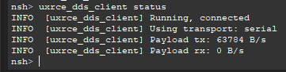

*[Figure 12](#figure-12): Checking uXRCE-DDS client status*

To list all topics available you can run in the MAVLink Shell 

```bash
    ls /obj
```

To list the topic available and get information in real-time regarding: topic name, multi-instance index, number of subscribers, publishing frequency in Hz, number of lost messages per second (for all subscribers combined), and queue size, you can run in the MAVLink Shell

```bash
    uorb top
```

To listen to the content of one topic (in this case `sensor_accel`), run the listener:

```bash
    listener sensor_accel
```


# 6 Installing ROS2 Galactic on Odroid

We assume you already have ROS2 Foxy installed and want to also install ROS2 Galactic and have the ability to switch between them for tests. The first step is to comment out the sourcing of the packages in `.bashrc`.

To do that 

```bash
    cd
    sudo nano .bashrc
```

scroll down to where you put the sourcing code

```bash
    source /opt/ros/foxy/setup.bash
```

and comment it out.
**Make sure you close the terminal** as we don't want ROS2 foxy packages to be sourced during the install of the new ROS2 version.

Next we want to install ROS2 Galactic. 

```bash
    locale  # check for UTF-8

    sudo apt update && sudo apt install locales
    sudo locale-gen en_US en_US.UTF-8
    sudo update-locale LC_ALL=en_US.UTF-8 LANG=en_US.UTF-8
    export LANG=en_US.UTF-8
    
    locale  # verify settings
```

Setup the sources

```bash
    sudo apt install software-properties-common
    sudo add-apt-repository universe
```

Now add the ROS 2 GPG key with apt.

```bash
    sudo apt update && sudo apt install curl
    sudo curl -sSL https://raw.githubusercontent.com/ros/rosdistro/master/ros.key -o /usr/share/keyrings/ros-archive-keyring.gpg
```

Then add the repository to your sources list.

```bash
    echo "deb [arch=$(dpkg --print-architecture) signed-by=/usr/share/keyrings/ros-archive-keyring.gpg] http://packages.ros.org/ros2/ubuntu $(. /etc/os-release && echo $UBUNTU_CODENAME) main" | sudo tee /etc/apt/sources.list.d/ros2.list > /dev/null
```

Update your apt repository caches after setting up the repositories.

```bash
    sudo apt upgrade
```

ROS 2 packages are built on frequently updated Ubuntu systems. It is always recommended that you ensure your system is up to date before installing new packages.

```bash
    sudo apt upgrade
```
ROS-Base Install (Bare Bones): Communication libraries, message packages, command line tools. No GUI tools.

```bash
    sudo apt install ros-galactic-ros-base
```

**Install** Development tools: Compilers and other tools to build ROS packages

```bash
    sudo apt install ros-dev-tools
```

If you have installed the Desktop version you can check that your distro is installed properly with running some examples as shown in the previous sections, replace `foxy` with `galactic` while you source. If you have any errors, refer to the previous sections for some bug fixes.

# 7 Setting up intel NUC with ROS2 Humble

Install Ubuntu 22.04 with a bootable usb and perform a minimal install. Reboot, go to the Boot Options and set the time to your current time zone if it is not set yet.

Update the packages. 

```bash
    sudo apt-get update -y && sudo apt-get upgrade -y
```

Install curl, wget and git

```bash
    sudo apt-get install curl wget git -y
```

## 7.1 Setting up Kernel

Ubuntu 22.04 ships with kernel version 6.8 as of writing. We need to downgrade to kernel version 5.15 which is the last supported kernel version for the librealsense2 developer sdk.

```bash
    # Choose kernel version to install
    kernel_version='5.15.0'
    
    # Install the old kernel
    curl -sL https://raw.githubusercontent.com/pimlie/ubuntu-mainline-kernel.sh/master/ubuntu-mainline-kernel.sh | sudo bash -s -- -i "v$kernel_version"
    
    # Get the Grub entry name
    # Note: Do verify the value of `grub_entry_name`. The following command gets
    #       the oldest kernel version Grub entry name that is not a recovery mode.
    # Example value: `Ubuntu, with Linux 6.5.0-45-generic`
    grub_entry_name="$(grep -Po "menuentry '\KUbuntu, [^(']+" /boot/grub/grub.cfg | sort -V | head -1)"
    
    # Update `grub`
    sed -i "s/^\s*GRUB_DEFAULT=.*$/GRUB_DEFAULT='Advanced options for Ubuntu>$grub_entry_name'/" /etc/default/grub
    sudo update-grub
    
    # Disable the kernel package upgrade
    sudo apt-mark hold $(dpkg --get-selections | grep -Po "^linux[^\t]+${grub_entry_name##* }")
    
    # Reboot system
    reboot
    
    # Check the currently booted Linux kernel version
    uname -r    
```

Now update the system repositories and upgrade again

```bash
    sudo apt-get update 
    sudo apt-get upgrade
```

You might get an error stating something like the following:

```bash
    Reading package lists... Done
    Building dependency tree... Done
    Reading state information... Done
    You might want to run 'apt --fix-broken install' to correct these.
    The following packages have unmet dependencies:
     linux-headers-5.15.0-051500-generic : Depends: libssl1.1 (>= 1.1.0) but it is not installable
    E: Unmet dependencies. Try 'apt --fix-broken install' with no packages (or specify a solution).
```

This is because we have forced the system to never update the kernel. you can fix it by manually installing that dependancy

```bash
    wget http://archive.ubuntu.com/ubuntu/pool/main/o/openssl/libssl1.1_1.1.0g-2ubuntu4_amd64.deb
    sudo dpkg -i libssl1.1_1.1.0g-2ubuntu4_amd64.deb
```

## 7.2 Install libasio

his package is needed for the UDP communication for VICON.

```bash
    sudo apt-get update -y
    sudo apt-get install -y libasio-dev
```

## 7.3 Install latest CMake Package

Prepare for installation

```bash
    sudo apt update && \
    sudo apt install -y software-properties-common lsb-release && \
    sudo apt clean all
```

Obtain a copy of kitware's signing key.

```bash
    wget -O - https://apt.kitware.com/keys/kitware-archive-latest.asc 2>/dev/null | gpg --dearmor - | sudo tee /etc/apt/trusted.gpg.d/kitware.gpg >/dev/null
```

Add kitware's repository to your sources list for Ubuntu

```bash
    sudo add-apt-repository "deb https://apt.kitware.com/ubuntu/ $(lsb_release -cs) main"
```

As an optional step, is recommended that we also install the kitware-archive-keyring package to ensure that Kitware's keyring stays up to date as they rotate their keys.

```bash
    sudo apt update
    sudo apt install kitware-archive-keyring
    sudo rm /etc/apt/trusted.gpg.d/kitware.gpg
    sudo apt-get update
```

If running `sudo apt-get update` gets the following error:

```bash
Err:7 https://apt.kitware.com/ubuntu bionic InRelease
    The following signatures couldnt be verified because the public key is not available: NO_PUBKEY "{KEY}"
    Fetched 11.0 kB in 1s (7552 B/s)
```

Copy the public key - "{KEY}" for example 6AF7F09730B3F0A4 and run this command (make sure to replace the example key with the key that is shown for you):

```bash
    sudo apt-key adv --keyserver keyserver.ubuntu.com --recv-keys 6AF7F09730B3F0A4
```

Finally we can update and install the cmake package.

```bash
    sudo apt update
    sudo apt install cmake
```

After installation check if the latest version is installed

```bash
    cmake --version
```

Make sure the version is at least more than version "3.20". 

## 7.4 Setting up the Access Point

The package to build the accesspoint is the same as the one in the ODroid setup instructions. We use the `Ralink Technology, Corp. RT5370 Wireless Adapter` and it is known to have the chipset to create a 2.4Ghz wifi accesspoint with the `create_ap` repository.

First, we install some dependencies:

```bash
    sudo apt install -y libgtk-3-dev build-essential gcc g++ pkg-config make hostapd libqrencode-dev libpng-dev wireless-tools
```

Install the dependencies for the wifi drivers

```bash
    sudo apt install iw dnsmasq iptables -y
```

Now navigate to the home folder and use the following commands to clone and install the package

```bash
    cd
    git clone https://github.com/lakinduakash/linux-wifi-hotspot
    cd linux-wifi-hotspot

    # building binaries
    make

    # install
    sudo make install
```

Now you can launch the utility by typing the following in the terminal

```bash
    wihotspot
```

Now you will see a dialog box open as shown in [Figure 13](#figure-13).

> **Note**:  Choose your SSID and Password as you please. We strongly recommend setting the password as the same as the SSID. You need to enable the gateway and set the ip to `192.168.12.1`. Disable the dns masq.
While SSH-ing into the NUC from the groundstation, you might run into some error that say that the MAC or KEY is not recognized. If you are on windows go to `C:\Users\<username>.ssh`, open `known_hosts` using notepad, delete all the contents in the file and save it. Now try SSH-ing back and you can. On Ubuntu, run the command that shows up on the terminal.


#### Figure 13
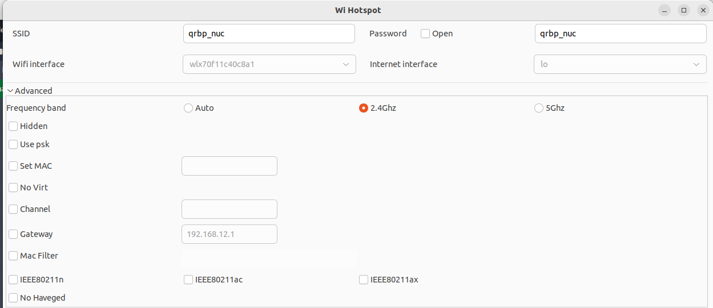

*[Figure 13](#figure-13): Settings for access point*

Now to enable the accesspoint on startup type in,

```bash
    sudo systemctl enable create_ap
```

Now you have to make sure the firewall of the nuc is off and that we have started and setup the `ssh` sever.

```bash
    sudo ufw status 
```

The output should be `Status:inactive` by default. Next install the `net-tools` package and then the `ssh` package

```bash
    sudo apt-get install net-tools
    sudo apt-get install ssh
```

Finally, start the ssh server of the nuc.

```bash
    sudo systemctl start ssh
```

Reboot the system and check if you can find your access point and are able to ssh in. Type in your ground station computer:

```bash
    ssh <name-you-see-in-the-terminal-in-the-nuc>@192.168.12.1
```

By default, the gateway is `192.168.12.1`, If you have changed it, enter that gateway ip. The default password is: `odroid`.

## 7.5 Installing Latest Boost Libraries

To install boost run the following

```bash
    # go to home folder
    cd 

    # clone the repository
    git clone --recursive https://github.com/boostorg/boost.git

    # start the binary script
    ./bootstrap.sh

    # run the binary compilation script
    ./b2

    # install the compiled binaries
    sudo ./b2 install

    # update the dynamic linker for the boost libraries
    sudo ldconfig
```

## 7.6 Install ROS2 Humble Barbones

Run the following to install ROS2 Humble Barebones version on the NUC. If you want to you could install the full desktop version and get the Rviz and Gazebo setups to visualize everything but for our purposes the barebones version is more than enough 

```bash

    # Setting up the locale
    locale  # check for UTF-8

    sudo apt update && sudo apt install locales
    sudo locale-gen en_US en_US.UTF-8
    sudo update-locale LC_ALL=en_US.UTF-8 LANG=en_US.UTF-8
    export LANG=en_US.UTF-8
    
    locale  # verify settings

    # Ensure that the Ubuntu Universe repository is enabled
    sudo apt install software-properties-common
    sudo add-apt-repository universe

    # Now add the ROS 2 GPG key with apt
    sudo apt update && sudo apt install curl -y
    sudo curl -sSL https://raw.githubusercontent.com/ros/rosdistro/master/ros.key -o /usr/share/keyrings/ros-archive-keyring.gpg

    # Then add the repository to your sources list
    echo "deb [arch=$(dpkg --print-architecture) signed-by=/usr/share/keyrings/ros-archive-keyring.gpg] http://packages.ros.org/ros2/ubuntu $(. /etc/os-release && echo $UBUNTU_CODENAME) main" | sudo tee /etc/apt/sources.list.d/ros2.list > /dev/null

    # Update and Upgrade
    sudo apt-get update && sudo apt-get upgrade -y

    # Install Barebones
    sudo apt install ros-humble-ros-base

    # Install development tools: Compilers and other tools to build ROS packages
    sudo apt install ros-dev-tools

    # Add the following to the .bashrc script for the terminal to source
    # at startup as this is the only ros2 version we will use
    nano ~/.basrc

    # Add this to the end and save it 
    source /opt/ros/humble/setup.bash
    
```

## 7.7 Install librealsense sdk v2.53.1

The scripts and commands below invoke `wget, git, add-apt-repository`. Make sure we have them installed if we haven't done so already in the previous sections.

```bash
    # update the repositories
    sudo apt-get update

    # install the packages
    sudo apt-get install wget git software-properties-common

```

Before proceeding further make sure the system is upto date and that we are on the latest stable version of the 15.5 kernel (Done in [Section 7.1](#71-setting-up-kernel) ).


```bash
    # check the kernel version
    uname -r
```

your output should look something like `5.15.0-051500-generic`, the first digit and the following two digits after the period are what matter. Now, make sure the system is upto date

```bash
    # update the repositories
    sudo apt-get update

    # upgrade the system
    sudo apt-get upgrade -y
```

Type in the password if required. Now we need to clone the exact version of the firmware that supports both our T265 and the D435i cameras that we use at the lab.

```bash
    # go to the home directory
    cd 

    # download recursively the v2.53.1 branch 
    git clone --branch v2.53.1 --recurse-submodules https://github.com/IntelRealSense/librealsense.git

    # go to the librealsense directory
    cd librealsense

    # check if this is the right tag
    git describe --tags
```

Now, we need to prepare the linux backend the the dev environment. Install the core packages requried to build *librealsense* binaries and the affected kernel modules:

```bash
    sudo apt-get install libssl-dev libusb-1.0-0-dev libudev-dev pkg-config libgtk-3-dev
```

Now install some distribution-specific packages:

```bash
    sudo apt-get install libglfw3-dev libgl1-mesa-dev libglu1-mesa-dev at
```

Now, run the Intel Realsense permissions script from the root directory. **Make sure all the cameras are *disconnected* before proceeding**.

```bash
    # go to the root directory
    cd ~/librealsense

    # Run the permssions script
    sudo ./scripts/setup_udev_rules.sh
```

> **Note**:  One can always remove permissions by running:
        `sudo ./scripts/setup_udev_rules.sh --uninstall`

Now build the binaries with cmake

```bash
    # go to librealsense root
    cd ~/librealsense

    # build and cd into build directory
    mkdir build && cd build

    # run cmake
    cmake ../ -DFORCE_RSUSB_BACKEND=TRUE
```

Recompile and install *librealsense* binaries:

```bash
    sudo make uninstall && make clean && make -j8 && sudo make install
```

The shared object will be installed in `/usr/local/lib`, header files in `/usr/local/include`.
The binary demos, tutorials and test files will be copied into `/usr/local/bin`.

```bash
    # Run the following command to refresh the object linker in linux
    sudo ldconfig
```

# 8 C++ wrapper for Python using Boost Libraries

After you have set everything up the normal way go to the directory where you cloned boost libraries

```bash
    # make sure python3 is installed but run the installation just in case
    sudo apt install python3-dev

    # install numpy and scipy
    sudo pip3 install numpy scipy

    # upgrade them to the latest version
    sudo pip3 install --upgrade scipy numpy

    # navigate to the boost library directory
    cd ~/boost

    # run the boost python installation script
    ./bootsrap.sh --with-python
    ./b2 --with-python

    # finish installation
    sudo ./b2 install
    
```


# 9 Create your own ROS2 package on Odroid

## 9.1 Create the workspace

Before creating a package we need to create a ROS2 workspace. A workspace is a directory containing ROS 2 packages. Before using ROS 2, it’s necessary to source your ROS 2 installation workspace in the terminal you plan to work in. This makes ROS 2’s packages available for you to use in that terminal. The source command is:

```bash
    source /opt/ros/foxy/setup.bash
```

A best practice is to create a new directory for every new workspace. For this example, let’s choose the directory name `ros2_ws`:

```bash
    mkdir -p ~/ros2_ws/src
    cd ~/ros2_ws/src
```

Clone the `px4_msgs` repo from GitHub. Make sure to clone the right branch, in this case, since we are interested in the *main* branch we can type:

```bash
    git clone https://github.com/PX4/px4_msgs.git
```

Otherwise, if we want to clone a specific branch we can use the following command:

```bash
    git clone --single-branch --branch <branch name> https://github.com/PX4/px4_msgs.git
```


Before building the workspace, you need to resolve the package dependencies. You may have all the dependencies already, but best practice is to check for dependencies every time you clone. From the root of your workspace `ros2_ws`, run the following command:

> **Note**: If `rosdep` throws an error because it is not installed you can install it by running: `
        sudo rosdep init`, and `rosdep update`

```bash
    rosdep install -i --from-path src --rosdistro foxy -y
```

If you already have all your dependencies, the console will return:

```bash
    #All required rosdeps installed successfully
```
From the root of your workspace `ros2_ws`, you can now build your packages using the command:

```bash
    colcon build
```

Once the build is finished, enter `ls` in the workspace root `ros2_ws` and you will see that colcon has created new directories:

```bash
    build  install  log  src
```

The `install` directory is where your workspace’s setup files are, which you can use to source your overlay.

> **Note**: Before sourcing the overlay, it is very important that you open a new terminal, separate from the one where you built the workspace. Sourcing an overlay in the same terminal where you built, or likewise building where an overlay is sourced, may create complex issues.

In the new terminal, source your main ROS 2 environment as the "underlay”, so you can build the overlay "on top of” it:

```bash
    source /opt/ros/foxy/setup.bash
```

Go into the root of your workspace:

```bash
    cd ~/ros2_ws
```

In the root, source your overlay:

```bash
    source install/local_setup.bash
```

> **Note**:  Sourcing the `local_setup` of the overlay will only add the packages available in the overlay to your environment. `setup` sources the overlay as well as the underlay it was created in, allowing you to utilize both workspaces.
So, sourcing your main ROS 2 installation’s `setup` and then the `ros2_ws` overlay’s `local_setup`, like you just did, is the same as just sourcing `ros2_ws`’s `setup`, because that includes the environment of its underlay.

## 9.2 Create the package

A package is an organizational unit for your ROS 2 code. If you want to be able to install your code or share it with others, then you’ll need it organized in a package. With packages, you can release your ROS 2 work and allow others to build and use it easily.

Package creation in ROS 2 uses "ament" as its build system and colcon as its build tool. You can create a package using CMake.

ROS 2 CMake packages have their own minimum required contents:

1. `CMakeLists.txt` file that describes how to build the code within the package

2. `include/<package\_name>` directory containing the public headers for the package

3. `package.xml` file containing meta information about the package

4. `src` directory containing the source code for the package

A single workspace can contain as many packages as you want, each in their own folder. You can also have packages of different build types in one workspace (CMake, Python, etc.).

> **Note**:  You cannot have nested packages.

Best practice is to have a src folder within your workspace, and to create your packages in there. This keeps the top level of the workspace “clean”.

A trivial workspace might look like:

```bash
    workspace_folder/
        src/
          cpp_package_1/
              CMakeLists.txt
              include/cpp_package_1/
              package.xml
              src/
    
          py_package_1/
              package.xml
              resource/py_package_1
              setup.cfg
              setup.py
              py_package_1/
          ...
          cpp_package_n/
              CMakeLists.txt
              include/cpp_package_n/
              package.xml
              src/
```

Make sure you are in the `src` folder before running the package creation command:

```bash
    cd ~/ros2_ws/src
```
The command syntax for creating a new package in ROS 2 is:

```bash
    ros2 pkg create --build-type ament_cmake <package_name>
```

Putting packages in a workspace is especially valuable because you can build many packages at once by running colcon build in the workspace root. 
Return to the root of your workspace and build your packages:

```bash
    cd ~/ros2_ws
    colcon build
```

To build only one of the packages (for example `my_package`) in your workspace if there is no need to build the others, you can run:

```bash
    colcon build --packages-select my_package
```

## 9.3 Example: `thrust_stand` package for directly controlling motors

In this example, we explain the most meaningful sections of the `thrust_stand` package, which is required for running the motor tests and directly controlling the motors.

### 9.3.1 Directories structure

The structure of the directories looks like the following:

```bash
# Directories structure

ws_thrust_stand/
    build/
        px4_msgs/
            ...
        thrust_stand/
            control_motors
            ...
    install/
        local_setup.bash
        setup.bash
        ...
    log/
        ...
    src/
        px4_msgs/
            ...
        thrust_stand/
            include/
                json/
                    ...
                thrust_stand/
            params/
                config.json
            src/
                json_parser/
                    json_parser.cpp
                    json_parser.h
                control_motors.cpp
            CMakeLists.txt
            package.xml
```

### 9.3.2 `control_motors.cpp`
Here is the code of `control_motors.cpp`, which creates a ROS2 node denominated "`offboard_control`".

```cpp
/* control_motors.cpp

	Mattia Gramuglia
	April 2, 2024
*/

#include <px4_msgs/msg/actuator_motors.hpp>
#include <px4_msgs/msg/offboard_control_mode.hpp>
#include <px4_msgs/msg/vehicle_command.hpp>
#include <px4_msgs/msg/vehicle_control_mode.hpp>
#include <rclcpp/rclcpp.hpp>
#include <stdint.h>

#include <chrono>
#include <iostream>
#include <string>
#include <fstream>

#include "json_parser.h"

using namespace std::chrono;
using namespace std::chrono_literals;
using namespace px4_msgs::msg;

class OffboardControl : public rclcpp::Node
{
public:
	OffboardControl() : Node("offboard_control")
	{

		offboard_control_mode_publisher_ = this->create_publisher<OffboardControlMode>("/fmu/in/offboard_control_mode", 10);
		vehicle_command_publisher_ = this->create_publisher<VehicleCommand>("/fmu/in/vehicle_command", 10);
		actuator_motors_publisher_ = this->create_publisher<ActuatorMotors>("/fmu/in/actuator_motors", 10);

		offboard_setpoint_counter_ = 0;

		auto timer_callback = [this]() -> void {

			if (offboard_setpoint_counter_ == 10) {
				// Change to Offboard mode after 10 setpoints
				this->publish_vehicle_command(VehicleCommand::VEHICLE_CMD_DO_SET_MODE, 1, 6);

				// Arm the vehicle
				this->arm();
			}

			// offboard_control_mode is paired with ActuatotorMotors commands 
			publish_offboard_control_mode();
			publish_actuator_motors();

			// stop the counter after reaching 11
			if (offboard_setpoint_counter_ < 11) {
				offboard_setpoint_counter_++;
			}
		};
		timer_ = this->create_wall_timer(100ms, timer_callback);
	}

	void arm();
	void disarm();

private:
	rclcpp::TimerBase::SharedPtr timer_;

	rclcpp::Publisher<OffboardControlMode>::SharedPtr offboard_control_mode_publisher_;
	rclcpp::Publisher<VehicleCommand>::SharedPtr vehicle_command_publisher_;
	rclcpp::Publisher<ActuatorMotors>::SharedPtr actuator_motors_publisher_;

	std::atomic<uint64_t> timestamp_;   //!< common synced timestamped

	uint64_t offboard_setpoint_counter_;   //!< counter for the number of setpoints sent

	void publish_offboard_control_mode();
	void publish_actuator_motors();
	void publish_vehicle_command(uint16_t command, float param1 = 0.0, float param2 = 0.0);
};

/**
 * @brief Send a command to Arm the vehicle
 */
void OffboardControl::arm()
{
	publish_vehicle_command(VehicleCommand::VEHICLE_CMD_COMPONENT_ARM_DISARM, 1.0);

	RCLCPP_INFO(this->get_logger(), "Arm command send");
}

/**
 * @brief Send a command to Disarm the vehicle
 */
void OffboardControl::disarm()
{
	publish_vehicle_command(VehicleCommand::VEHICLE_CMD_COMPONENT_ARM_DISARM, 0.0);

	RCLCPP_INFO(this->get_logger(), "Disarm command send");
}

/**
 * @brief Publish the offboard control mode.
 *        For this example, only direct_actuator control is active.
 */
void OffboardControl::publish_offboard_control_mode()
{
	OffboardControlMode msg{};
	msg.position = false;
	msg.velocity = false;
	msg.acceleration = false;
	msg.attitude = false;
	msg.body_rate = false;
	msg.thrust_and_torque = false;
	msg.direct_actuator = true;
	msg.timestamp = this->get_clock()->now().nanoseconds() / 1000;
	offboard_control_mode_publisher_->publish(msg);
}

/**
 * @brief Publish a actuator_motors command
 *        For this example, we send fixed motor commands.
 */
void OffboardControl::publish_actuator_motors()
{
  // For debugging, print each line of config.json file
	std::ifstream file("./src/thrust_stand/params/config.json");
	if (file.is_open()) {
    std::string line;
    while (getline(file, line)) {
        std::cout << line << std::endl;
    }
    file.close();
	} else {
		  std::cerr << "Unable to open file" << std::endl;
	}

	MotorsCommands motors_commands = readJSONConfig("./src/thrust_stand/params/config.json");

	ActuatorMotors msg{};
	msg.control[0] = motors_commands.motor_1;
	msg.control[1] = motors_commands.motor_2;
	msg.control[2] = motors_commands.motor_3;
	msg.control[3] = motors_commands.motor_4;
	msg.control[4] = motors_commands.motor_5;
	msg.control[5] = motors_commands.motor_6;
	msg.control[6] = motors_commands.motor_7;
	msg.control[7] = motors_commands.motor_8;
	msg.reversible_flags = 0;
	msg.timestamp = this->get_clock()->now().nanoseconds() / 1000;
	actuator_motors_publisher_->publish(msg);
}

/**
 * @brief Publish vehicle commands
 * @param command   Command code (matches VehicleCommand and MAVLink MAV_CMD codes)
 * @param param1    Command parameter 1
 * @param param2    Command parameter 2
 */
void OffboardControl::publish_vehicle_command(uint16_t command, float param1, float param2)
{
	VehicleCommand msg{};
	msg.param1 = param1;
	msg.param2 = param2;
	msg.command = command;
	msg.target_system = 1;
	msg.target_component = 1;
	msg.source_system = 1;
	msg.source_component = 1;
	msg.from_external = true;
	msg.timestamp = this->get_clock()->now().nanoseconds() / 1000;
	vehicle_command_publisher_->publish(msg);
}

int main(int argc, char *argv[])
{
	std::cout << "Starting offboard control node..." << std::endl;
	setvbuf(stdout, NULL, _IONBF, BUFSIZ);
	rclcpp::init(argc, argv);
	rclcpp::spin(std::make_shared<OffboardControl>());

	rclcpp::shutdown();
	return 0;
}
```


Let's examine the code found in `control_motors.cpp` section by section.

The top of the code includes the standard PX4 message types that we will be using. `rclcpp/rclcpp.hpp` allows us to use the most common pieces of the ROS 2 system.
Then we find the standard C++ headers we will be using and on line 19 our custom-made header file for using the functions to parse JSON files.

> **Note**:  These lines represent the node’s dependencies. Recall that dependencies have to be added to `package.xml` and `CMakeLists.txt`, which will be shown next.

```cpp
#include <px4_msgs/msg/actuator_motors.hpp>
#include <px4_msgs/msg/offboard_control_mode.hpp>
#include <px4_msgs/msg/vehicle_command.hpp>
#include <px4_msgs/msg/vehicle_control_mode.hpp>
#include <rclcpp/rclcpp.hpp>
#include <stdint.h>

#include <chrono>
#include <iostream>
#include <string>
#include <fstream>

#include "json_parser.h"

using namespace std::chrono;
using namespace std::chrono_literals;
using namespace px4_msgs::msg;
```

The next line creates the node class `OffboardControl` by inheriting from `rclcpp::Node`.

> **Note**:  Every `this` in the code is referring to the node.

```cpp
class OffboardControl : public rclcpp::Node
```

The public constructor names the node `offboard_control`. Inside the constructor, the publishers are initialized with the appropriate message type (e.g. `<OffboardControlMode>`), the topic name (e.g. "`/fmu/in/offboard_control_mode`"), and the required queue size to limit messages in the event of a backup (e.g. `10`).

```cpp
public:
	OffboardControl() : Node("offboard_control")
	{

		offboard_control_mode_publisher_ = this->create_publisher<OffboardControlMode>("/fmu/in/offboard_control_mode", 10);
		vehicle_command_publisher_ = this->create_publisher<VehicleCommand>("/fmu/in/vehicle_command", 10);
		actuator_motors_publisher_ = this->create_publisher<ActuatorMotors>("/fmu/in/actuator_motors", 10);

		offboard_setpoint_counter_ = 0;
```

Although the lambda function itself doesn't have a name, it is assigned to the variable `timer_callback`. So while the lambda function itself is anonymous, the variable `timer_callback` acts as a reference to that function within the code.

<div style="border:1px solid #aaa; padding:10px; border-radius:6px; background-color:#f9f9f9;">

**Note:** In C++, the basic syntax of a lambda function looks like this:  
`[capture-list] (parameters) -> return-type { function-body }`

Where:

- **`capture-list`**: Specifies which variables from the enclosing scope should be captured by the lambda. It can be empty `[]`, or specify variables to capture by value `[var1, var2]` or by reference `[&var1, &var2]`.
- **`parameters`**: The list of parameters for the lambda function, similar to regular function parameters.
- **`return-type`**: The return type of the lambda function. This can be omitted if the return type can be deduced from the function body.
- **`function-body`**: The body of the lambda function, which contains the code to be executed.

</div>


The `timer_callback` function is where the message data is set and the messages are actually published.
Next, `timer_` is initialized, which causes the `timer_callback` function to be executed every 100 ms.
 
```cpp
		auto timer_callback = [this]() -> void {

			if (offboard_setpoint_counter_ == 10) {
				// Change to Offboard mode after 10 setpoints
				this->publish_vehicle_command(VehicleCommand::VEHICLE_CMD_DO_SET_MODE, 1, 6);

				// Arm the vehicle
				this->arm();
			}

			// offboard_control_mode is paired with ActuatotorMotors commands
			publish_offboard_control_mode();
			publish_actuator_motors();

			// stop the counter after reaching 11
			if (offboard_setpoint_counter_ < 11) {
				offboard_setpoint_counter_++;
			}
		};
        timer_ = this->create_wall_timer(100ms, timer_callback);
```

On line 41:

```cpp
    this->publish_vehicle_command(VehicleCommand::VEHICLE_CMD_DO_SET_MODE, 1, 6);
```

The parameters of the function `publish_vehicle_command` (Line 156) `param1 = 1` and `param2 = 6` are used to tell the vehicle to switch to `Offboard Mode`. More specifically, it is based on the MAVLink command `MAV_CMD_DO_SET_MODE (176)` shown in \autoref{fig:MAV_CMD_DO_SET_MODE.png} and on `VEHICLE_CMD_DO_SET_MODE` found in the `uORB` message `VehicleCommand`.

```
    uint16 VEHICLE_CMD_DO_SET_MODE = 176			# Set system mode. |Mode, as defined by ENUM MAV_MODE| Empty| Empty| Empty| Empty| Empty| Empty|
```

#### Figure 14


*[Figure 14](#figure-14): MAV_CMD_DO_SET_MODE*

So: 
- `param1` is set to 1 to enable the custom mode.

- `param2` is set to 6 to enable Offboard mode.

Other options for `param2` include:

- `param2` = 1 (MANUAL).

- `param2` = 2 (ALTCTL)

- `param2` = 3 (POSCTL)

- `param2` = 4 (AUTO)

- `param2` = 5 (ACRO)

- `param2` = 6 (OFFBOARD)

- `param2` = 7 (STABILIZED)

- `param2` = 8 (RATTITUDE)

For more information on the topic refer to: [https://discuss.px4.io/t/where-to-find-custom-mode-list-for-mav-cmd-do-set-mode/32756/9](https://discuss.px4.io/t/where-to-find-custom-mode-list-for-mav-cmd-do-set-mode/32756/9)

Here the `arm()` and `disarm()` functions are declared:

```cpp
	void arm();
	void disarm();
```

Here the declaration of the timer, publishers, counter fields, and publish-specific functions:

```cpp
	private:
	rclcpp::TimerBase::SharedPtr timer_;

	rclcpp::Publisher<OffboardControlMode>::SharedPtr offboard_control_mode_publisher_;
	rclcpp::Publisher<VehicleCommand>::SharedPtr vehicle_command_publisher_;
	rclcpp::Publisher<ActuatorMotors>::SharedPtr actuator_motors_publisher_;

	std::atomic<uint64_t> timestamp_;   //!< common synced timestamped

	uint64_t offboard_setpoint_counter_;   //!< counter for the number of setpoints sent

	void publish_offboard_control_mode();
	void publish_actuator_motors();
	void publish_vehicle_command(uint16_t command, float param1 = 0.0, float param2 = 0.0);
};
```

Here, inside the `publish_actuator_motors()` function, is where the JSON file is parsed to read the values to input directly to each motor.

> **Note**:  "`./src/thrust\_stand/params/config.json`" is a relative path that goes from the ***root workspace directory*** (e.g. `ws_thrust_stand`) to the JSON file (e.g. `config.json`). All relative paths must be relative to the *root workspace directory*.

```cpp
MotorsCommands motors_commands = readJSONConfig("./src/thrust_stand/params/config.json");
```

Following the `OffboardControl` class is `main`, where the node actually executes. `rclcpp::init` initializes ROS 2, and `rclcpp::spin` starts processing data from the node, including callbacks from the timer.

```cpp
int main(int argc, char *argv[])
{
	std::cout << "Starting offboard control node..." << std::endl;
	setvbuf(stdout, NULL, _IONBF, BUFSIZ);
	rclcpp::init(argc, argv);
	rclcpp::spin(std::make_shared<OffboardControl>());

	rclcpp::shutdown();
	return 0;
}
```

### 9.3.3 `package.xml`

All *ament packages* must contain a single `package.xml` file at the root of the package regardless of their underlying build system. The `package.xml` "manifest” file contains information that is required in order to process and operate on a package. This package information includes things like the package’s name, which is globally unique, and the package’s dependencies. The `package.xml` file also serves as the marker file which indicates the location of the package on the file system.

In short, `package.xml` is a package manifest file that marks the root of a package and contains meta-information about the package including its name, version, description, maintainer, license, dependencies, and more.

Next is the code found in `package.xml`:

```xml
<?xml version="1.0"?>
<?xml-model href="http://download.ros.org/schema/package_format3.xsd" schematypens="http://www.w3.org/2001/XMLSchema"?>
<package format="3">
  <name>thrust_stand</name>
  <version>0.0.0</version>
  <description>Package for running motor tests on the ACSL thrust stand</description>
  <maintainer email="mgramuglia@vt.edu">Mattia Gramuglia</maintainer>
  <license>Apache License 2.0</license>

  <buildtool_depend>ament_cmake</buildtool_depend>
  
  <depend>px4_msgs</depend>
  <depend>rclcpp</depend>

  <test_depend>ament_lint_auto</test_depend>
  <test_depend>ament_lint_common</test_depend>

  <export>
    <build_type>ament_cmake</build_type>
  </export>
</package>
```

Make sure to fill in the `<name>`, `<description>`, `<maintainer>` and `<license>` tags:

```xml
  <name>thrust_stand</name>
  <version>0.0.0</version>
  <description>Package for running motor tests on the ACSL thrust stand</description>
  <maintainer email="mgramuglia@vt.edu">Mattia Gramuglia</maintainer>
  <license>Apache License 2.0</license>
```

Add a new line after the `ament_cmake` buildtool dependency and paste the following dependencies corresponding to your node’s include statements. This declares the package needs `rclcpp` and `px4_msgs` when its code is built and executed.

```xml
  <depend>px4_msgs</depend>
  <depend>rclcpp</depend>
```
Leave the rest as is and make sure to save the file.


### 9.3.4 `CMakeLists.txt`

```make
cmake_minimum_required(VERSION 3.5)
project(thrust_stand)

# Default to C99
if(NOT CMAKE_C_STANDARD)
  set(CMAKE_C_STANDARD 99)
endif()

# Default to C++14
if(NOT CMAKE_CXX_STANDARD)
  set(CMAKE_CXX_STANDARD 14)
endif()

if(CMAKE_COMPILER_IS_GNUCXX OR CMAKE_CXX_COMPILER_ID MATCHES "Clang")
  add_compile_options(-Wall -Wextra -Wpedantic)
endif()

# find dependencies
find_package(ament_cmake REQUIRED)
find_package(px4_msgs REQUIRED)
find_package(rclcpp REQUIRED)

# Include directories
include_directories(${CMAKE_CURRENT_SOURCE_DIR}/include)
include_directories(${CMAKE_CURRENT_SOURCE_DIR}/src/json_parser)
include_directories(${CMAKE_CURRENT_SOURCE_DIR}/include/json)
include_directories(${CMAKE_CURRENT_SOURCE_DIR}/include/json/include)

# Add source files
set(SOURCES
	src/json_parser/json_parser.cpp
	src/control_motors.cpp
)

# Add executable
add_executable(control_motors ${SOURCES})

# Add header files to the target
target_include_directories(control_motors PUBLIC)

ament_target_dependencies(control_motors px4_msgs rclcpp)

install(TARGETS
	control_motors
	DESTINATION lib/${PROJECT_NAME})

if(BUILD_TESTING)
  find_package(ament_lint_auto REQUIRED)
  # the following line skips the linter which checks for copyrights
  # uncomment the line when a copyright and license is not present in all source files
  #set(ament_cmake_copyright_FOUND TRUE)
  # the following line skips cpplint (only works in a git repo)
  # uncomment the line when this package is not in a git repo
  #set(ament_cmake_cpplint_FOUND TRUE)
  ament_lint_auto_find_test_dependencies()
endif()

ament_package()
```

Below the default existing dependency `find_package(ament_cmake REQUIRED)`, we added the following lines, which identify the packages needed to build the code:

```make
find_package(px4_msgs REQUIRED)
find_package(rclcpp REQUIRED)
```

Then we add the directories of external libraries and custom-made header files:

```make
include_directories(${CMAKE_CURRENT_SOURCE_DIR}/include)
include_directories(${CMAKE_CURRENT_SOURCE_DIR}/src/json_parser)
include_directories(${CMAKE_CURRENT_SOURCE_DIR}/include/json)
include_directories(${CMAKE_CURRENT_SOURCE_DIR}/include/json/include)
```

Then we define all the source files:

```make
set(SOURCES
	src/json_parser/json_parser.cpp
	src/control_motors.cpp
)
```

Then we create an executable which we call `control_motors`:

```make
add_executable(control_motors ${SOURCES})
```

Then here we add the package dependencies that we previously declared in Lines 20-21:

```make
ament_target_dependencies(control_motors px4_msgs rclcpp)
```

Save the file and exit.

# 10 FlightStack

To manually clone repos in the `include` directory of the `flightstack` package:

```bash
    git clone --single-branch --branch 3.4 https://gitlab.com/libeigen/eigen.git
    git clone https://github.com/nlohmann/json.git
    git clone --recursive https://github.com/boostorg/boost.git
```

If you already have a local branch on your machine and you want to update it to the latest version you can run the following commands:

```bash
    git fetch
    git pull
    git submodule update --init
    git submodule update --recursive
```

After having cloned the `boost` library run the following commands:

```bash
    ./bootstrap.sh
    ./b2
    sudo ./b2 install
```

The previous manual procedure is not necessary anymore as the `flightstack` contains a `.gitmodules` file where all the submodules are already defined and will be automatically downloaded by adding the `--recurse-submodules` flag when cloning.

## 10.1 Running the Flightstack with Real-Time priority
To make the Flightstack run as fast as possible and prioritize it in the OS scheduler, you can follow these steps.

Create a file in your root directory called `run_flightstack.sh`

```bash
    #!/bin/bash

    # Before running this program, make it executable with the command:
    # chmod +x ~/run_flightstack.sh 

    # Change to the ROS2 flightstack workspace directory
    cd ~/ws_flightstack

    # Source the ROS2 and workspace setup scripts and run the flightstack with 
    # Scheduling policy: SCHED_FIFO
    # Scheduling priority: 99
    echo "odroid" | sudo -S bash -c "source /opt/ros/foxy/setup.bash && source install/local_setup.bash && chrt -f 99 ros2 run flightstack flightstack"
```

Before running this program, make it executable with the command:

```bash
    chmod +x ~/run_flightstack.sh 
```

Now, to execute the Flightstack, run the following command:

```bash
    ./run_flightstack.sh 
```

# 11 GPS Firmware Update

## 11.1 Flash Ardupilot Firmware onto Pixhawk

This section details the steps needed to update the firmware of the Here 3+ RTK GPS Module. This can **only** be done using Arducopter and not PX4-Autopilot. You will need a secondary Pixhawk board (Pixhawk 4 and up recommended as they have the necessary JST connectors to plug in your Here 3+ rover) to update the firmware on the GPS as you do not want the main Pixhawk (we use 6C) to get messed up.

The first step is to load the ChibiOS run Ardupilot onto the pixhawk board. Please go to the following link and choose the folder with your Pixhawk board of choice. We choose `Pixhawk4`.

[https://firmware.ardupilot.org/Copter/latest/](https://firmware.ardupilot.org/Copter/latest/)
Download the `.apj` file as shown in [Figure 15](#figure-15).

#### Figure 15
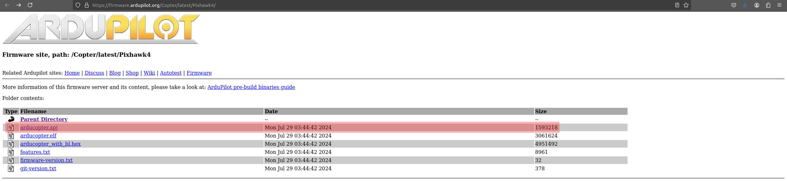

*[Figure 15](#figure-15): Ardupilot Firmware*


Navigate to the directory where you saved the ardupilot firmware and then open a terminal. We need to then type in the following command to rename the `.apj` file to the correct format `.px4`.

```bash
    mv arducopter.apj arducopter.px4
```

Once that is done, plug in your pixhawk board and open up QGroundControl. Then navigate to the firmware tab as shown in [Figure 16](#figure-16)

#### Figure 16
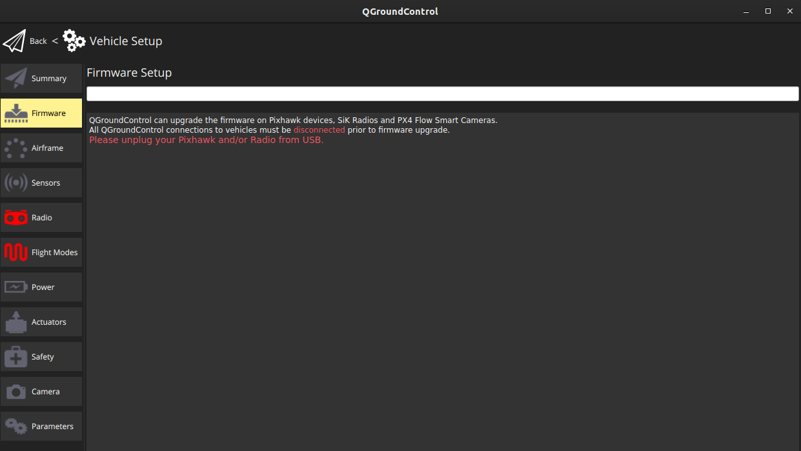

*[Figure 16](#figure-16): QgroundControl Firmware Tab*


Follow the instructions and unplug and replug the pixhawk. A dialogue box will open up. Pick the options as shown in [Figure 17](#figure-17).

#### Figure 17
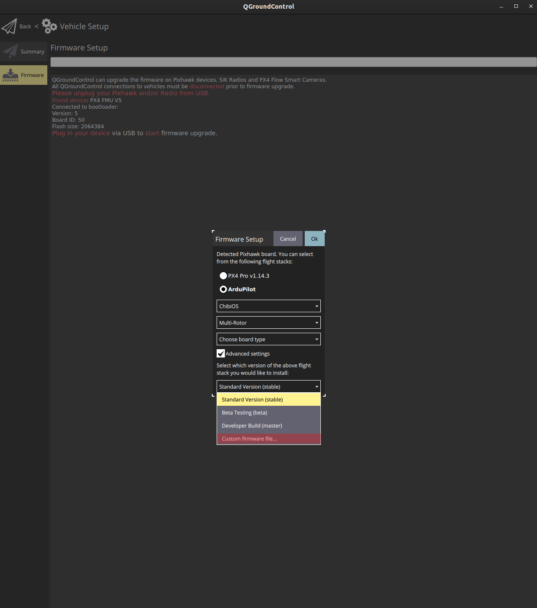

*[Figure 17](#figure-17): QgroundControl Firmware Option*

Move onto the next subsection.

## 11.2 Installing Ardupilot

For this section, a Windows operating system is a **must**. Ardupilot mission planner does not work smoothly on Linux-based systems. Go to the following link and install Ardupilot Mission Planner ( you will need version `1.3.74` or higher).

[https://ardupilot.org/planner/docs/mission-planner-installation.html](https://ardupilot.org/planner/docs/mission-planner-installation.html)


After installation, connect the Pixhawk over USB. Then navigate to  `Setup -> Install Firmware` as shown in [Figure 18](#figure-18).

#### Figure 18
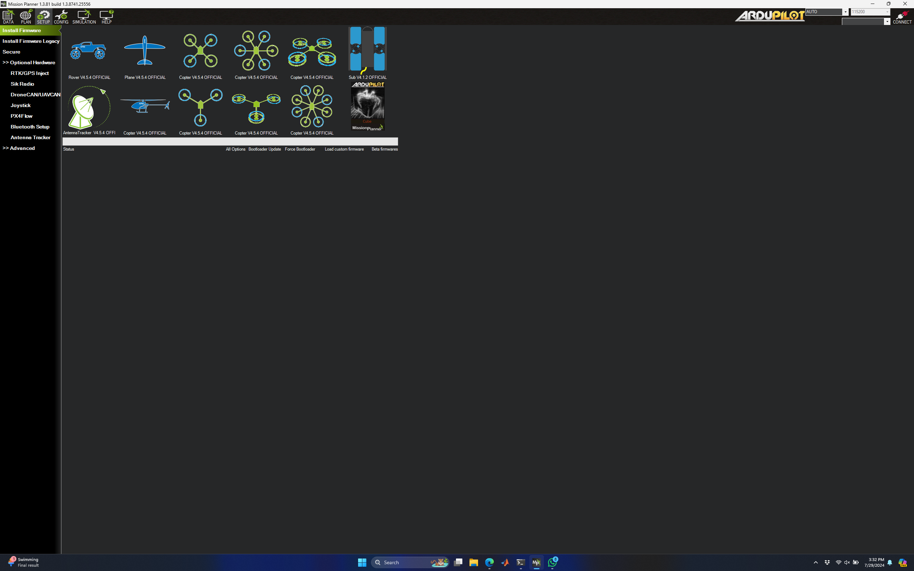

*[Figure 18](#figure-18): Ardupilot Arducopter Firmware*


Pick the arducopter option and follow the instructions on the mission planner dialogue boxes to install the firmware. Once completed, unplug and replug the board and hit the connect button on the top right corner of the screen by selecting the autopilot SLCAN COM port in the port options with 115200 baud rate as shown in [Figure 19](#figure-19). You should now be connected to the Pixhawk. 

#### Figure 19
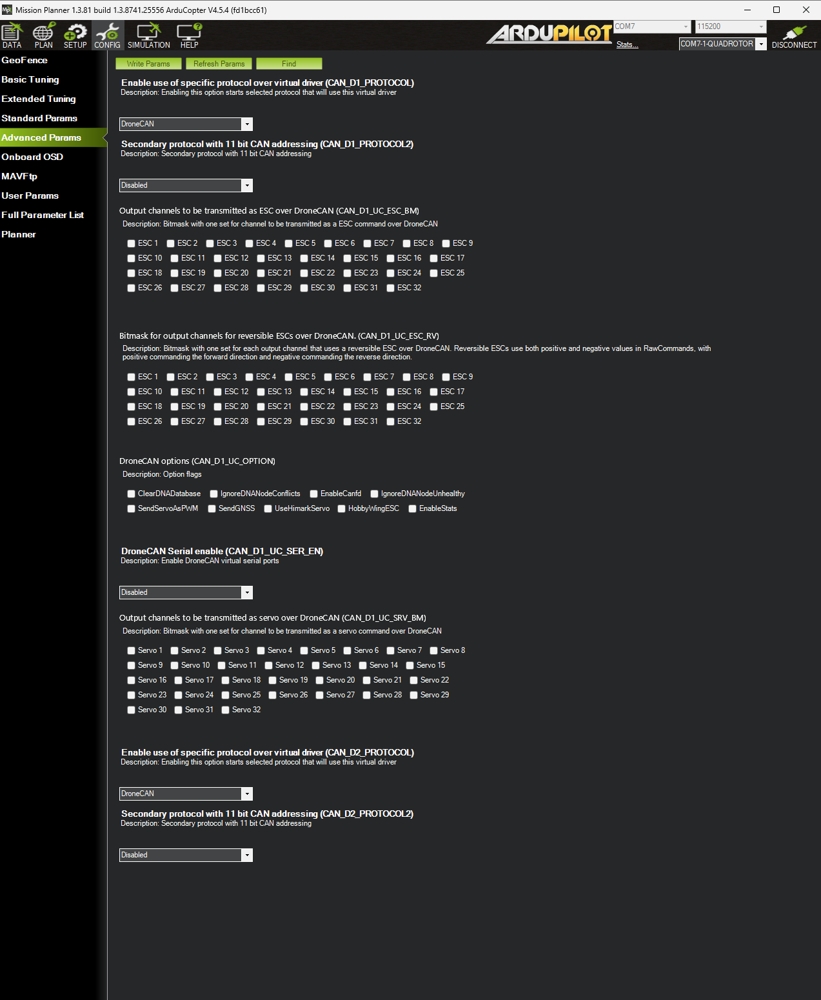

*[Figure 19](#figure-19): Ardupilot Arducopter Firmware ports*

The next step is clicking on `CONFIG -> Advanced Params` and using the `Find` option as shown in [Figure 19](#figure-19) and set both 

```bash
    CAN_D1_PROTOCOL=DroneCAN
    CAN_D2_PROTOCOL=Drone_CAN
```

Then click on `write params` to write it to the Pixhawk. Then go to `SETUP -> DroneCAN/UAVCAN` and click pon `MAVlink CAN1`. You should see the devices on the CAN network be listed as shown in [Figure 20](#figure-20).

#### Figure 20
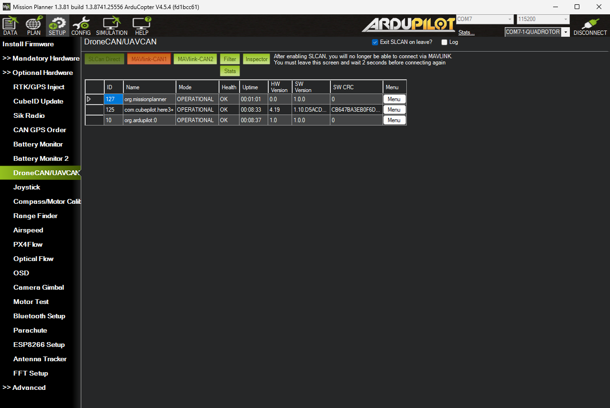

*[Figure 20](#figure-20): DroneCAN settings*

Now, click on `Menu` next to the `com.cubepilot.here3+` and click on `Update`. Click `yes` in the dialogue box that pops up to search the internet for the new firmware and wait for it to be downloaded.

> **Note**:   If the `Update` option isn't working as well. Pick `Update Beta` and then click on yes. Then go back and click on `Update` to finish the update. The process is a bit finicky and might need multiple tries to hit update.  
